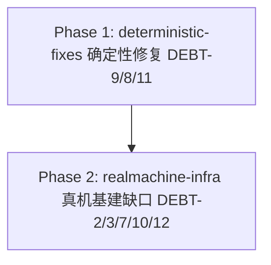

# Phase 拆分计划 — 修复 vscode-dsh-e2e-closure 活跃技术债

> 工作流 slug：`fix-e2e-closure-debts`。本文档由 plan-generator 产出，Phase ID 是后续所有阶段（current_phase / 分支名 / spec 路径）的**唯一真相源**，任何 Agent 或调度者不得另起名字。

## 总体策略

本工作流把 8 条活跃债务按「改动确定性 + 是否需真机」两分，收敛为 **2 个 Phase**（线性 DAG）：

1. **Phase 1（确定性修复）**：DEBT-9（产品 bug 防泄漏词边界）、DEBT-8（manifest `requiresModel` 修正）、DEBT-11（过时脚本清理 + 4 处守卫）。共同点：改动面清晰、可静态/单测/轻量真机直接验证，不依赖真实 LLM 大批量往返。DEBT-9 是唯一纯 `src/` 改动，与其他债务无文件冲突。
2. **Phase 2（真机基建缺口）**：DEBT-2（测试可达性）、DEBT-3（流式增量可观测）、DEBT-7（webview 探测通道）、DEBT-10（真实模型委托）、DEBT-12（per-capability 状态隔离）。共同点：均需真实 LLM 往返 + 真机，改动面较大；DEBT-12 依赖 manifest 落定，放 Phase 2 最后。

> **Phase 2 工作量显著放大（相对上一版）**：三条「二选一」债务全部改为**真修**——DEBT-7 要动 `webview/src/probes.ts` + `chat-panel/protocol.ts` + `chat-panel-host.ts` + `extension.ts`（补 host 侧渲染探测通道）；DEBT-10 要新增一条走真实模型委托链路的 capability + 一个门控观测命令；DEBT-12 要新增门控复位命令 + 全链驱动复位。Phase 2 内部按「探测通道 → 真实委托 → 状态隔离」自然分三段推进，但总 Phase 数仍保持 2（三段共享同一 manifest/驱动改动面，拆成 3 个 Phase 会造成同一文件跨 Phase 反复写、且每段都需独立真机跑全链，代价大于收益）。

> 串行化理由：DEBT-7/8/10/12 均改 `layer-v-capabilities.json`（同一文件），且 DEBT-12 的「全链一键跑通 41 项」验收依赖其余 manifest 相关债务（DEBT-8 `requiresModel:true`、DEBT-9 探针文件、DEBT-10 `requiresModel:false`）先行落定。Phase 2 依赖 Phase 1 先把 manifest 确定性部分落定，避免跨 Phase 并行写冲突。

## Phase DAG



## Phase 列表

| Phase | id | 名称 | 范围 | 依赖 | AC |
|-------|----|------|------|------|:--:|
| Phase 1 | `phase-1-deterministic-fixes` | 确定性修复（产品 bug + manifest 修正 + 脚本清理） | DEBT-9 / DEBT-8 / DEBT-11 | 无 | AC-1, AC-2, AC-3, AC-10, AC-11, AC-12, AC-13 |
| Phase 2 | `phase-2-realmachine-infra` | 真机基建缺口（测试可达性 / 流式可观测 / 探测通道 / 真实委托 / 状态隔离） | DEBT-2 / DEBT-3 / DEBT-7 / DEBT-10 / DEBT-12 | `phase-1-deterministic-fixes` | AC-1, AC-4, AC-5, AC-6, AC-7, AC-8, AC-9, AC-12, AC-13 |

> AC-1（范围授权）、AC-12（回归护栏）、AC-13（诚实登记）是横切 AC：两个 Phase 各自遵守并验收本 Phase 子集。AC-2/3/10/11 归 Phase 1，AC-4/5/6/7/8/9 归 Phase 2。

## DAG 任务编排（JSON）

```json
{
  "slug": "fix-e2e-closure-debts",
  "phases": [
    {
      "id": "phase-1-deterministic-fixes",
      "name": "确定性修复（产品 bug + manifest 修正 + 脚本清理）",
      "ui": false,
      "dependencies": [],
      "acceptance_criteria": ["AC-1", "AC-2", "AC-3", "AC-10", "AC-11", "AC-12", "AC-13"]
    },
    {
      "id": "phase-2-realmachine-infra",
      "name": "真机基建缺口（测试可达性 / 流式可观测 / 探测通道 / 真实委托 / 状态隔离）",
      "ui": false,
      "dependencies": ["phase-1-deterministic-fixes"],
      "acceptance_criteria": ["AC-1", "AC-4", "AC-5", "AC-6", "AC-7", "AC-8", "AC-9", "AC-12", "AC-13"]
    }
  ]
}
```

> 全部 `ui: false`：本工作流不新增/修改任何产品 UI 视图文件（HTML/CSS/JSX/TSX），交付物是产品代码 bug 修复（字符串判定）+ 验证基础设施（bash + CJS 驱动 + manifest）。截图是验证证据而非「被设计的界面」（`requirements.md` §UI 相关性）。
>
> ⚠️ 边界说明：DEBT-7 真修会**触碰 `webview/src/probes.ts` 与 `chat-panel/protocol.ts`**，但改动是「新增 `probe/render-state` 测试探测帧 + 扩展 `__dshProbes` 探测面」，属 `VSCODE_DSH_TEST=1` 门控的测试探测通道（`data-testid` 属性本身无视觉影响），不改变任何页面/组件/样式/布局/主题，故 `ui` 字段仍为 `false`，不启用原型门禁 / reviewer-visual / HG-1.5。详见 `design.md` §UI / Design System。

## 每个 Phase 的详细说明

### Phase 1: 确定性修复（DEBT-9 / DEBT-8 / DEBT-11）

- **目标**：修复 `selection-ask.ts` 防泄漏误报（DEBT-9）、修正 `cap-history-panel`/`cap-message-list-streaming` 的 `requiresModel`（DEBT-8）、清理 `run-chat-ready-regression.sh` 及 4 处守卫（DEBT-11）。
- **输入**：`requirements.md` AC-2/3/10/11 + AC-1/12/13；`design.md` §实现方案 DEBT-9/8/11；`repo-exploration.md` §3/§5。
- **产出**：修复后的 `selection-ask.ts`；`layer-v-capabilities.json` 的 DEBT-9 探针文件 + DEBT-8 两项 `requiresModel:true` + 步骤；删除 `run-chat-ready-regression.sh` + 4 处守卫更新；DEBT-9 单元测试（如有既有测试文件）。
- **验收**：见 `phases/phase-1-deterministic-fixes/spec.md`。

### Phase 2: 真机基建缺口（DEBT-2 / DEBT-3 / DEBT-7 / DEBT-10 / DEBT-12）

- **目标**：修复 fork emptySeed 自启动（DEBT-2）、流式增量可观测（DEBT-3）、webview 探测通道（DEBT-7，**真修**：补 host 侧渲染探测通道）、subagent 真实委托（DEBT-10，**真修两步**：修正 `requiresModel` + 新增真实委托 capability）、per-capability 状态隔离（DEBT-12，**真修**：复用 host + 真实复位，断言保持原语义）。
- **输入**：`requirements.md` AC-4/5/6/7/8/9 + AC-1/12/13；`design.md` §实现方案 DEBT-2/3/7/10/12；`repo-exploration.md` §4/§5。
- **产出**：`layer-v-capabilities.json` 的 DEBT-2/3/7/10/12 manifest 修正（含 9 项 webview 渲染断言升级 + 新增 `cap-delegate-subagent-model` + 复位步）；`webview/src/probes.ts`（DEBT-7 探测面）；`chat-panel/protocol.ts` + `chat-panel-host.ts`（DEBT-7 探测帧）；`extension.ts`（DEBT-7 `queryWebviewRenderState` / DEBT-10 `listChildren` / DEBT-12 `resetToIdle`，均 `VSCODE_DSH_TEST=1` 门控）；`layer-v-shadow-preset.sh` / `run-layer-v-capabilities.sh` / `run-vscode-dsh-e2e-closure.sh` / `capability-runner.cjs`（DEBT-2 fork preset / DEBT-12 复位）；全链一键跑通 41 项证据。
- **验收**：见 `phases/phase-2-realmachine-infra/spec.md`。
