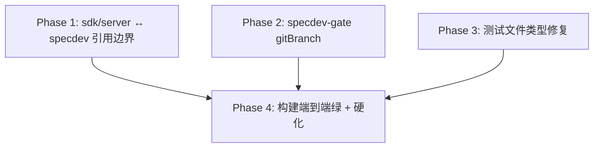

# Phase 拆分计划：fix-host-build-tsc-errors

## 总体策略

本 bugfix 的 4 个功能区域（FA-1~FA-4）中，FA-1/FA-2/FA-3 分别对应三类**相互独立**的类型债（引用边界 / 真实类型债 / 测试类型债），可并行修复；FA-4 是端到端绿 + 构建硬化，必须等前三类全部消除后才能有意义的验证。因此拆成 **3 个无依赖叶子 Phase + 1 个集成 Phase**：

- Phase 1 是最大单项（30 条，占 3/4 错误量），且是结构性根因，单列。
- Phase 2 / Phase 3 小而独立，可与 Phase 1 并行。
- Phase 4 依赖 1+2+3，负责 Q-2 硬化 + 全链路退出码 0 验证。

## Phase DAG



## Phase 列表

| Phase | id | 名称 | 范围 | 依赖 | 验收标准 |
|-------|----|------|------|------|:--:|
| Phase 1 | `phase-1-sdk-server-specdev-ref` | sdk/server ↔ specdev 引用边界修复 | FA-1 | 无 | AC-3 |
| Phase 2 | `phase-2-specdev-gate-gitbranch` | specdev-gate gitBranch 类型修复 | FA-2 | 无 | AC-4 |
| Phase 3 | `phase-3-test-type-debt` | 测试文件类型债修复 | FA-3 | 无 | AC-5 |
| Phase 4 | `phase-4-build-green-tsdown` | 构建端到端绿 + tsdown 硬化 | FA-4 + Q-2 | Phase 1, Phase 2, Phase 3 | AC-1, AC-2, AC-6, AC-7 |

## DAG 任务编排（JSON）

```json
{
  "phases": [
    {
      "id": "phase-1-sdk-server-specdev-ref",
      "name": "sdk/server ↔ specdev 引用边界修复",
      "dependencies": [],
      "acceptance_criteria": ["AC-3"]
    },
    {
      "id": "phase-2-specdev-gate-gitbranch",
      "name": "specdev-gate gitBranch 类型修复",
      "dependencies": [],
      "acceptance_criteria": ["AC-4"]
    },
    {
      "id": "phase-3-test-type-debt",
      "name": "测试文件类型债修复",
      "dependencies": [],
      "acceptance_criteria": ["AC-5"]
    },
    {
      "id": "phase-4-build-green-tsdown",
      "name": "构建端到端绿 + tsdown 硬化",
      "dependencies": [
        "phase-1-sdk-server-specdev-ref",
        "phase-2-specdev-gate-gitbranch",
        "phase-3-test-type-debt"
      ],
      "acceptance_criteria": ["AC-1", "AC-2", "AC-6", "AC-7"]
    }
  ]
}
```

## 每个 Phase 的详细说明

### Phase 1: sdk/server ↔ specdev 引用边界修复
- 目标：让 sdk/server 对 specdev 的 import 走 project reference，修正依赖声明，消 30 条 TS6059/TS6307。
- 输入：requirements.md §FA-1、§AC-3、§决策 Q-3；design.md §决策 D-1。
- 产出：`packages/sdk/server/tsconfig.json`（references[]）、`packages/sdk/server/package.json`（dependencies/peerDependencies/devDependencies）。
- 验收：`tsc -b packages/sdk/server` 退出码 0，0 个 TS6059 / TS6307。

### Phase 2: specdev-gate gitBranch 类型修复
- 目标：消 2 条 TS2379，gitBranch 实参在 `exactOptionalPropertyTypes` 下不含 undefined。
- 输入：requirements.md §FA-2、§AC-4；design.md §决策 D-2。
- 产出：`packages/specdev/specdev-gate/src/index.ts`（两处条件展开）。
- 验收：`tsc -b packages/specdev/specdev-gate` 退出码 0，0 个 TS2379。

### Phase 3: 测试文件类型债修复
- 目标：消 8 条（1×TS2379 + 5×TS2769 + 2×TS2352），三个测试文件在 host aggregate 下通过类型检查。
- 输入：requirements.md §FA-3、§AC-5、§Q-1=all_fix；design.md §决策（FA-3）。
- 产出：`packages/ide/ide-bridge/tests/ide-bridge.spec.ts`、`packages/specdev/specdev-advance/tests/specdev-advance.spec.ts`、`packages/specdev/specdev/tests/specdev.spec.ts`。
- 验收：host aggregate tsc 输出中这三个文件 0 个 TS2379 / TS2769 / TS2352。

### Phase 4: 构建端到端绿 + tsdown 硬化
- 目标：补 command-specdev 显式 tsdown 入口，验证 `build:lib:host` 全链路退出码 0。
- 输入：requirements.md §FA-4、§AC-1/2/6/7、§Q-2；design.md §决策 D-3。
- 产出：`packages/specdev/command-specdev/tsdown.config.ts`（新增）。
- 验收：`tsc -b tsconfig.host.json` exit 0、`pnpm run build:lib:host` exit 0、command-specdev 无 "Cannot find entry"、失败可定位。
