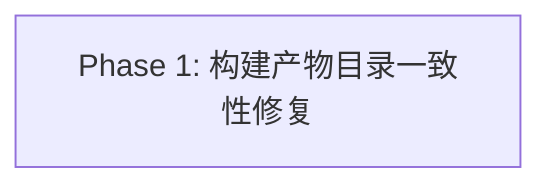

# Phase 拆分计划

## 总体策略

本任务是**单一、内聚的构建配置修复**（bugfix），不涉及多模块或多阶段交付。根因集中在一个 app 的「构建产物目录与运行时入口错位」，修复面收敛为 3 个文件（新增 1 个 tsdown 配置 + 改根 tsdown workspace + 改 package.json 的 files/scripts/devDeps），无运行时逻辑改动、无新功能、无跨包接口变更。因此**不拆多 Phase**，用单个 Phase 一次完成并通过验收。

拆分理由（为什么不拆）：
1. 所有改动相互依赖、必须原子生效——「补包级 tsdown 配置」与「纳入根 workspace」缺一不可，拆开任一都无法独立产出正确 runtime。
2. 验收标准 AC-1 ~ AC-11 全部围绕「一次构建后布局自洽」这一个可观测终态，无法按 AC 分组到可独立验收的子阶段。
3. `/bugfix` 流程约定单 Phase；`/brief` 亦如此。多 Phase 只会引入无意义的 HG-3 往返。

## Phase DAG



## Phase 列表

| Phase | 名称 | 范围 | 依赖 | 验收标准数 |
|-------|------|------|------|:--------:|
| Phase 1 | 构建产物目录一致性修复 | 补 `apps/vscode-dsh/tsdown.config.ts`；根 `tsdown.config.ts` workspace 纳入；`apps/vscode-dsh/package.json` files/scripts/devDeps 调整 | 无 | 11（AC-1 ~ AC-11） |

## DAG 任务编排（JSON）

```json
{
  "phases": [
    {
      "id": "phase-1-build-outdir",
      "name": "构建产物目录一致性修复",
      "dependencies": [],
      "acceptance_criteria": [
        "AC-1",
        "AC-2",
        "AC-3",
        "AC-4",
        "AC-5",
        "AC-6",
        "AC-7",
        "AC-8",
        "AC-9",
        "AC-10",
        "AC-11"
      ]
    }
  ]
}
```

## 每个 Phase 的详细说明

### Phase 1: 构建产物目录一致性修复

- **目标**：让 `apps/vscode-dsh` 的「构建产物落盘位置」与 `package.json` 的 `main`/`types`/`exports`/`files` 四字段严格对齐；执行正确构建命令后，`main` 与 `exports["."].default` 从当前 `src/` 重新生成且含 editor-chat-panel；类型入口真实存在；`tsc -b` 仍 0 错误、既有 vitest 全绿、构建可复现/幂等/离线可跑。
- **输入**：`requirements.md` § AC-1 ~ AC-11（EARS）；`design.md`（决策 1/2/3）。
- **产出**：
  - `apps/vscode-dsh/tsdown.config.ts`（新增）
  - `tsdown.config.ts`（根，workspace 追加）
  - `apps/vscode-dsh/package.json`（files/scripts/devDeps）
  - `apps/vscode-dsh/lib/extension.js` + `lib/index.js`（构建产物，gitignored）
  - `tech-debt-registry.md`（本次无 `@STUB`；若发现必须推迟的关联构建债，注册 `DEBT-N`）
  - `.cursor/skills/project-build/SKILL.md`（回填 host 侧产物链条目）
- **验收**：见 `phases/phase-1-build-outdir/spec.md`（逐 AC 验证方案）。
