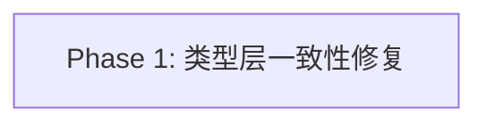

# Phase 拆分计划：fix-vscode-dsh-host-tsc

<!--
  slug: fix-vscode-dsh-host-tsc
  audience: HG-2 / implementer / reviewer / verifier
  language: zh
  nature: bugfix（单 Phase）
-->

## 总体策略

本 bugfix 是内聚的类型层一致性修复（三类根因、约 20 个错误），无需拆分多 Phase：三类修复互不依赖、改动面固定、验证单一（`tsc -b` 0 错误 + 相关 vitest 回归）。因此采用**单 Phase** 一次完成，符合 `/bugfix` 流程（不拆 Phase）。

实现顺序建议（供 implementer，非强依赖）：
1. 类别 2（`Thenable` → `PromiseLike`）与类别 3（`exactOptionalPropertyTypes` 条件展开）先行——纯局部类型修正，与命名决策无关。
2. 类别 1（`SearchHit.matchTier` → `matchTiers`）后行——依赖 Q-1 已拍板（复数），一处接口改名闭环。
3. 全部改完跑 `tsc -b apps/vscode-dsh` 验证 0 错误，再跑相关 vitest 证明运行时无回归。

## Phase DAG



## Phase 列表

| Phase | 名称 | 范围 | 依赖 | 验收标准数 |
|-------|------|------|------|:--------:|
| Phase 1 | 类型层一致性修复 | 三类根因：tier 字段统一 / Thenable 替换 / exactOptionalPropertyTypes 改写 | 无 | 11 |

## DAG 任务编排（JSON）

```json
{
  "phases": [
    {
      "id": "phase-1-fix",
      "name": "类型层一致性修复",
      "dependencies": [],
      "acceptance_criteria": [
        "AC-1", "AC-2", "AC-3", "AC-4", "AC-5", "AC-6",
        "AC-7", "AC-8", "AC-9", "AC-10", "AC-11"
      ]
    }
  ]
}
```

## 每个 Phase 的详细说明

### Phase 1: 类型层一致性修复

- **目标**：`tsc -b apps/vscode-dsh` 严格编译 0 错误，且运行时行为零变化。
- **输入**：`requirements.md` §AC-1…AC-11；`design.md` §7 精确改动清单。
- **产出**：
  - `apps/vscode-dsh/src/search/session-search.ts`（1 处改名）
  - `apps/vscode-dsh/src/extension.ts`（6 处 `Thenable`→`PromiseLike` + 1 处条件展开）
  - `apps/vscode-dsh/src/code-context/selection-ask.ts`（1 处替换）
  - `apps/vscode-dsh/src/change/revert.ts`（1 处条件展开）
  - `apps/vscode-dsh/src/conversation-controller.ts`（4 处条件展开）
- **验收**：以 `design.md` §5 验证策略为准——AC-1（`tsc -b` 0 错误）、AC-2（相关 vitest 全绿）、AC-3…AC-11 逐条可判定。
- **约束**：最小一致性修复；不引入新依赖；不改运行时逻辑 / 线契约 / Webview 产物；`tech-debt-registry.md` 当前为空，本修复不产生 `@STUB`（修复即完成，不留债）。
