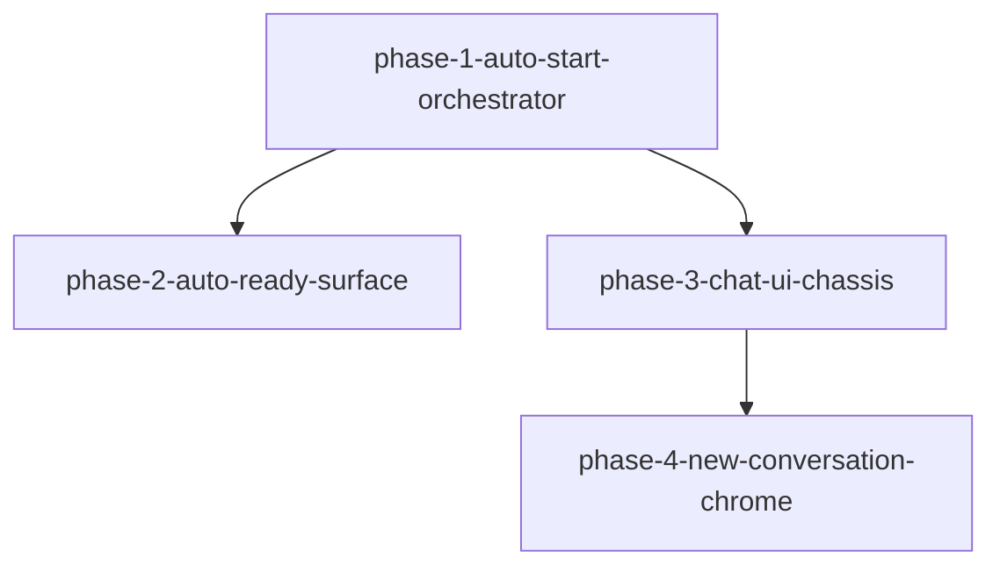

# Phase 拆分计划：vscode-dsh-chat-ready

<!--
  slug: vscode-dsh-chat-ready
  audience: orchestrator / implementer / reviewer / verifier / HG-2
  language: zh (canonical)
  design: design.md
  created: 2026-09-08
  revised: 2026-09-08 design R1 — phase-4 deps = phase-1+phase-3 only
-->

## 总体策略

按**依赖与可独立验收**切四段：先锁定自动建连编排与触发边界（含 L2 反向骨架），再交付视图可见自动就绪；Chat UI 底盘与就绪在 phase-1 之后**可并行**；顶栏新建/等待态/窄栏可达依赖「空 Tab 复用」与「chrome 底盘」两者就绪后收口。

相对 requirements「建议三段」的微调理由：

1. **拆出 phase-1 Start 编排**：start-reason、命令矩阵、离线删除、断线 retry-once、状态栏错误载体是后续一切的硬前置；单独验收可避免 UI 与就绪纠缠掩盖并发踩踏缺陷。
2. **phase-2 自动就绪独立**：与 Start 解耦是产品锁（D-2）；需专测 restore/未读/空 Tab/无工作区。
3. **phase-3 UI 底盘与 phase-2 并行**：呈现升级不依赖 restore 语义，只依赖 phase-1 的连接态投影缝；并行缩短关键路径。
4. **phase-4 新建 chrome 收口**：未连先 Start 等待态、按钮协议、窄栏可达依赖 **phase-1 Orchestrator** + **phase-3 顶栏/协议底盘**；**不**硬依赖 phase-2（空 Tab 复用函数可在 phase-4 内调用 Controller API，或由 phase-2 并行落地后复验 AC-6）。不宜并入 phase-3（否则未连路径与底盘耦合过重）。

横切：AD-CU-1 / AD-CR-11 / 不改 agent-loop / 前序回归；每 Phase ≥1 条 L2（适用时 L3）；B3/B5 写明可脚本驱动面。

## Phase DAG



ASCII 等价：

```
phase-1-auto-start-orchestrator
  ├→ phase-2-auto-ready-surface          （可与 phase-4 并行）
  └→ phase-3-chat-ui-chassis ──→ phase-4-new-conversation-chrome
```

## Phase 列表

| Phase | 名称 | 范围 | 依赖 | 验收标准数（约） |
|-------|------|------|------|:----------------:|
| 1 | 自动建连编排 | start-reason FSM；触发边界；reveal Conversation；离线删除；Host 单例；断线 retry-once；面板+状态栏错误载体；无工作区可 Start；L2 反向 + 连接态骨架 | 无 | ~14 |
| 2 | 自动就绪输入面 | 视图可见门闩；restore/New；空 Tab；未读抑制；无工作区降级；空 Tab 复用；L2 主路径全链路 | phase-1 | ~8 |
| 3 | Chat UI 底盘 | 主题/切换；气泡；底栏 Enter；Connecting/失败呈现加固；Markdown 安全+复制；侧栏 IA；L2/L3+L4 辅助 | phase-1 | ~16 |
| 4 | 顶栏新建 chrome | 常驻新建按钮；未连等待 Start；窄栏可达；`action/new-conversation` L2；Should 键盘辅入口 | phase-1, phase-3 | ~7 |

## DAG 任务编排（JSON）

```json
{
  "phases": [
    {
      "id": "phase-1-auto-start-orchestrator",
      "name": "自动建连编排 + start-reason + 触发/离线删除边界",
      "dependencies": [],
      "acceptance_criteria": [
        "AC-1", "AC-1a", "AC-1b", "AC-1c", "AC-1d", "AC-1e",
        "AC-2", "AC-5", "AC-6a", "AC-7",
        "AC-13", "AC-14",
        "AC-25", "AC-26"
      ]
    },
    {
      "id": "phase-2-auto-ready-surface",
      "name": "自动就绪：restore / New / 空 Tab / 未读策略",
      "dependencies": ["phase-1-auto-start-orchestrator"],
      "acceptance_criteria": [
        "AC-3", "AC-4", "AC-4a", "AC-4b",
        "AC-6", "AC-7",
        "AC-27"
      ]
    },
    {
      "id": "phase-3-chat-ui-chassis",
      "name": "可用级 Chat UI 底盘（主题/气泡/composer/MD/侧栏 IA）",
      "dependencies": ["phase-1-auto-start-orchestrator"],
      "acceptance_criteria": [
        "AC-7a",
        "AC-8", "AC-8a", "AC-9", "AC-10", "AC-11", "AC-12",
        "AC-16", "AC-16a", "AC-17", "AC-18",
        "AC-19", "AC-19a", "AC-20",
        "AC-25", "AC-27"
      ]
    },
    {
      "id": "phase-4-new-conversation-chrome",
      "name": "顶栏新建会话 + 等待 Start 态 + 窄栏可达",
      "dependencies": ["phase-1-auto-start-orchestrator", "phase-3-chat-ui-chassis"],
      "acceptance_criteria": [
        "AC-15", "AC-21", "AC-22", "AC-23", "AC-24",
        "AC-6",
        "AC-34"
      ]
    }
  ]
}
```

> 注：`AC-7` 在 phase-1 交付反向用例 + Start 触发可测骨架；phase-2 补齐「视图可见主路径」全链路证据。`AC-6` 活动空 Tab 复用核心可在 phase-2 或 phase-4 与 Controller 同步落地；phase-4 按钮路径必须复验。`AC-13`/`AC-14` 在 phase-1 落地连接态投影；phase-3 加固视觉文案。Should AC-28…AC-33 按余力落入 phase-3/4，**非** Must 门禁。phase-4 **不**等 phase-2。

## 每个 Phase 的详细说明

### Phase 1: 自动建连编排 + start-reason + 触发/离线删除边界

- **目标:** 点开活动栏/视图/启动·发送类命令/状态栏即可自动 Start；startup 不连；查询删除不连；失败可操作；断线最多自动重试一次；Orchestrator 含 `disconnected` 显式态。
- **输入:** requirements §F1、AC-1 系列、AC-2、AC-5、AC-6a、AC-7（部分）、AC-13/14、AC-25/26；design AD-CR-1/2/4/5/9/10
- **第一步（强制）:** code-explorer + 读现有 `startSession` / 视图可见性 / `newConversation` 空 Tab 判定，再划接线
- **产出:** `auto-start-orchestrator.ts`、`connection-ui.ts`、命令矩阵文档、状态栏、`dsh.showPanel` / settings / **test-gated** L2 钩子、相关测试
- **验收:** L1 FSM 并发 + 断线态迁移；L2 AC-1a 反向；有/无凭据；删除离线禁用/提示且不 Start；Host 单例

### Phase 2: 自动就绪 restore / New / 空 Tab / 未读

- **目标:** Conversation 可见 + Host 就绪 → restore 或 New；幂等不叠空 Tab；不自动 Continue；不打未读。
- **输入:** §F2、AC-3/4/4a/4b/6/7/27；AD-CR-3/6
- **产出:** `auto-ready-coordinator.ts`、`newConversationOrReuseEmpty`、L2 主路径用例
- **验收:** L2 视图可见全链路；空 Tab 不入 openTabSet；无工作区降级

### Phase 3: Chat UI 底盘

- **目标:** 可用级呈现：主题、气泡、底栏手势、安全 Markdown、侧栏 IA。
- **输入:** §B1–B6、AC-7a、AC-8…20、AC-25/27；AD-CR-7
- **产出:** chat-panel HTML/CSS/脚本升级、`dsh.copyToClipboard`、History 滤空、L3 否定用例、L4 截图辅助说明
- **验收:** L2/L3 主证据；L4 截图非唯一；主题切换可读

### Phase 4: 顶栏新建 + 等待态 + 窄栏

- **目标:** 顶栏常驻「新建会话」；未连先 Start 且等待态不可误示可发送；窄栏可达；L2 按钮证据。
- **输入:** §F8、AC-15/21–24/6/34；AD-CR-8/6
- **依赖:** `phase-1-auto-start-orchestrator` + `phase-3-chat-ui-chassis`（**不**依赖 phase-2）
- **产出:** chrome 按钮、`action/new-conversation`、等待态文案、可选 Should keybindings
- **验收:** L2 Tab+1 或活动空 Tab 复用；connecting 非 live；Should 键盘不替代按钮

## 验证 Traceability

**权威源：** `design.md`「验收标准验证方案」中的 VP 表 + AC→VP→Phase 矩阵（R2）。各 Phase `spec.md` 验证策略须引用 `VP-CR-*` id，不得仅用自由文本场景代替 AC 编号。

## 技术债 / 基线

- `tech-debt-registry.md` 当前无活跃债务。
- 实施前置：确认前序 `vscode-dsh-conversation-ui` 合入/分支基线（requirements R-1）；不得缩小本 Feature 目标。
