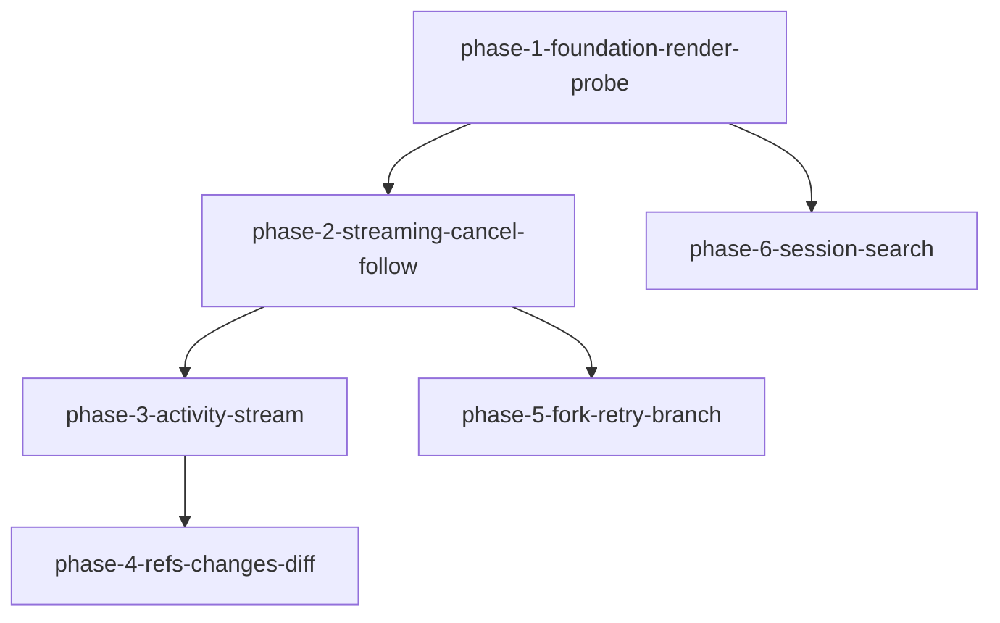

# Phase 拆分计划：vscode-dsh-chat-ux

<!--
  slug: vscode-dsh-chat-ux
  audience: orchestrator / implementer / reviewer / verifier / HG-2
  language: zh (canonical)
  design: design.md
  created: 2026-09-10
  policy: 单 slug；F0 层 A 不得拖到最后；无档 3；T6 锁定 B
-->

## 总体策略

按 **「先可测呈现基建 → 流式真中断 → 活动流 → 引用/diff → fork 产品路径 → 搜索」** 切六段，对齐 requirements F0–F5，并满足硬约束：

1. **phase-1（F0）无依赖先行**：抽离 render/sync + jsdom 层 A 骨架 + 探针 + 修订 AD-CU-1。禁止把层 A 整段拖到全部 UX 之后。
2. **phase-2（F1）** 依赖 phase-1：chunk 投影、节点身份、I-真 cancel、follow-state、T5 incomplete、fail-closed、不展示 thinking。
3. **phase-3（F2）** 依赖 phase-2：活动项内嵌依赖 cancel→aborted 与 streaming 探针契约；含 AC-13c 活动项 aborted。
4. **phase-4（F3）** 依赖 phase-3：变更/活动同组归组与引用卡建立在活动流 DOM 契约上。
5. **phase-5（F4）** 依赖 phase-2：fork 编排主要需 turn/cancel/incomplete 语义；可与 phase-3/4 **并行**（不依赖活动/引用完成）。
6. **phase-6（F5）** 仅依赖 phase-1：搜索与索引相对独立，可与 phase-2+ **并行**。

相对「建议六段」无合并：fork 与搜索体量与风险不同，分开验收更清晰。无第二 slug；无 Spike 门禁（探查 X1–X7 已足够开工）。

## Phase DAG



ASCII 等价：

```
phase-1-foundation-render-probe
  ├─→ phase-2-streaming-cancel-follow
  │     ├─→ phase-3-activity-stream ─→ phase-4-refs-changes-diff
  │     └─→ phase-5-fork-retry-branch
  └─→ phase-6-session-search
```

## Phase 列表

| Phase | 名称 | 范围 | 依赖 | 验收标准数 |
|-------|------|------|------|:--------:|
| 1 | 层 A 基建 + 呈现态边界 | 抽离 render/sync；jsdom；探针契约；修订 AD-CU-1；follow 决策函数骨架 | 无 | 9 |
| 2 | 流式 + 真 cancel + 跟滚 | chunk 投影；patch 节点身份；I-真 cancel；incomplete(aborted)；follow-state；fail-closed；无 thinking | phase-1 | 14 |
| 3 | 活动/工具流 | 内嵌活动项；折叠/归组；状态机含 aborted；回放重建；与变更组衔接预备 | phase-2 | 10 |
| 4 | 引用 / 变更 / diff | 共享引用解析；变更同组；T8 内联+跳原生；Timeline 弱化回归 | phase-3 | 6 |
| 5 | 消息交互与分叉 | 复制；重试/编辑 P-接续+E2；分叉 P-标明；AC-64；Continue 对照 | phase-2 | 13 |
| 6 | 会话搜索档 1+2 | 档 1 字段搜索；档 2 path→session 索引；打开不 Start；无档 3 | phase-1 | 4 |

## DAG 任务编排（JSON）

```json
{
  "phases": [
    {
      "id": "phase-1-foundation-render-probe",
      "name": "层 A 基建 + 呈现态边界与探针",
      "dependencies": [],
      "acceptance_criteria": [
        "AC-1", "AC-2", "AC-3", "AC-4", "AC-5", "AC-6", "AC-7", "AC-8", "AC-70"
      ]
    },
    {
      "id": "phase-2-streaming-cancel-follow",
      "name": "流式 chunk + I-真 cancel + follow-state",
      "dependencies": ["phase-1-foundation-render-probe"],
      "acceptance_criteria": [
        "AC-10", "AC-11", "AC-12", "AC-13", "AC-13b", "AC-13d",
        "AC-14", "AC-15", "AC-16", "AC-17", "AC-18", "AC-19",
        "AC-71", "AC-72"
      ]
    },
    {
      "id": "phase-3-activity-stream",
      "name": "对话内嵌活动流与状态机",
      "dependencies": ["phase-2-streaming-cancel-follow"],
      "acceptance_criteria": [
        "AC-13c", "AC-20", "AC-21", "AC-22", "AC-23", "AC-24",
        "AC-25", "AC-26", "AC-27", "AC-28"
      ]
    },
    {
      "id": "phase-4-refs-changes-diff",
      "name": "引用卡 + 变更归属 + 内联 diff",
      "dependencies": ["phase-3-activity-stream"],
      "acceptance_criteria": [
        "AC-40", "AC-41", "AC-42", "AC-43", "AC-44", "AC-45"
      ]
    },
    {
      "id": "phase-5-fork-retry-branch",
      "name": "复制 / P-接续重试编辑 / P-标明分叉",
      "dependencies": ["phase-2-streaming-cancel-follow"],
      "acceptance_criteria": [
        "AC-30", "AC-31", "AC-31b", "AC-32", "AC-33", "AC-34",
        "AC-60", "AC-61", "AC-62", "AC-63", "AC-64", "AC-65", "AC-66"
      ]
    },
    {
      "id": "phase-6-session-search",
      "name": "会话搜索档 1 + 档 2 path 索引",
      "dependencies": ["phase-1-foundation-render-probe"],
      "acceptance_criteria": [
        "AC-50", "AC-51", "AC-52", "AC-53"
      ]
    }
  ]
}
```

## 每个 Phase 的详细说明

### Phase 1: 层 A 基建 + 呈现态边界

- **目标**: 可脚本渲染进门槛；呈现态合法下放且可探针；决策态仍 Host。
- **输入**: requirements §F0、AC-1–8、AC-70；constitution §7.1/§7.2；X6。
- **产出**: `chat-panel/render/*`；jsdom 层 A harness；探针契约；protocol/panel 扩展位；design 合规注释修订 AD-CU-1。
- **验收**: 层 A 能挂载抽离模块并断言 DOM 属性；探针可读 follow-state 骨架；无整页 dangerously 主路径。

### Phase 2: 流式 + 真 cancel + 跟滚

- **目标**: 日常敢看流式、敢停、跟滚可测。
- **输入**: AC-10–19、AC-71/72；X1/X5；AD-CUX-3/4/7/10。
- **产出**: chunk→patch；bridge cancel；detectIncomplete 认 aborted；follow 接线；无 reasoning UI。
- **验收**: 层 A patch+follow；层 B cancel 真调用；fail-closed。

### Phase 3: 活动/工具流

- **目标**: 工具步骤在对话内可见、可折叠、状态可测。
- **输入**: AC-13c、AC-20–28；X5。
- **产出**: 活动项 DOM/投影；状态机；回放重建活动项；cancel→aborted。
- **验收**: 层 A 折叠；层 B/A 状态转移含 aborted。

### Phase 4: 引用 / 变更 / diff

- **目标**: 引用卡一致；变更同组；T8 diff。
- **输入**: AC-40–45；T8；R5。
- **产出**: 共享解析；内联 diff + 跳原生；Timeline 弱化回归。
- **验收**: 层 A/B 默认内联路径；回放不误导 live 发送。

### Phase 5: 消息交互与分叉

- **目标**: 复制/重试/编辑/分叉可用且机制正确。
- **输入**: AC-30–34、AC-60–66；X2/X3；AD-CUX-5/6。
- **产出**: fork 编排；P-接续+E2；P-标明；变更空桶；Continue 对照测试。
- **验收**: 层 B 新 sessionId / E2 探针 / AC-64；非法 boundary 拒绝。

### Phase 6: 会话搜索

- **目标**: 档 1+2 可搜可开；无档 3。
- **输入**: AC-50–53；X7；AD-CUX-9。
- **产出**: 搜索 UI/命令；path→session 索引；打开不 Start。
- **验收**: 层 B 命中来源可证；否定档 3。
