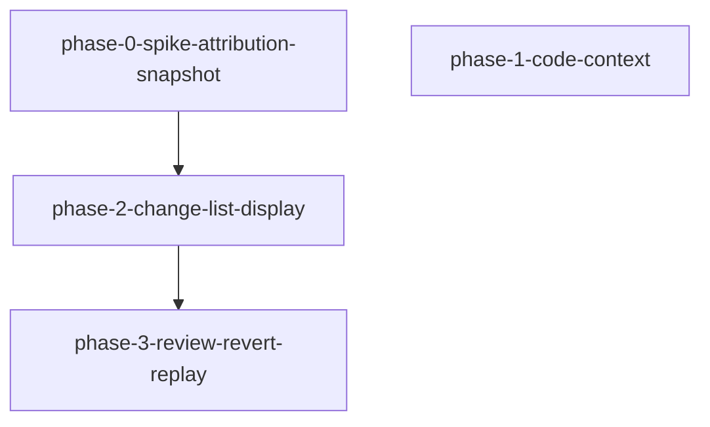

# Phase 拆分计划：vscode-dsh-code-context-diff

<!--
  slug: vscode-dsh-code-context-diff
  audience: orchestrator / implementer / reviewer / verifier / HG-2
  language: zh (canonical)
  design: design.md (R3.1a)
  created: 2026-09-09
  revised: 2026-09-09 — R3.1a rewrite：phase-1 = 指针+read+AC-3a/3b；废止正文注入
  policy: 禁止 Should/Could；Spike 门禁阻塞 phase-2/3
-->

## 总体策略

按 **Spike 门禁 + 可并行代码引用 + 感知展示 → 审阅撤销** 切四段：

1. **phase-0 Spike 先行（阻塞变更组）**：锁定归属、快照生命周期、误报测法；未 PASS **不得**开工 phase-2/3。
2. **phase-1 代码引用并行**：脏保存、选区/右键指针预填、`@路径` 校验（无内联）、ide 挂载 `FILE_REFERENCE_PROMPT`（AC-3b）、L2 stub 每 path read（AC-3a）。**不依赖** Spike。
3. **phase-2 变更列表**：Spike PASS 后入账、合并、消息下展示、安全 diff、AC-30 跳转。
4. **phase-3 审阅撤销回放**：reviewed、撤销门禁、AC-17、回放统计、AC-24/25。

横切：不改 agent-loop；快照不进权威日志；验证 L2/L3 为主；L4 不得作 Must 唯一证据；无 Should/Could。

## Phase DAG



ASCII 等价：

```
phase-0-spike-attribution-snapshot ──→ phase-2-change-list-display ──→ phase-3-review-revert-replay

phase-1-code-context   （无依赖；可与 phase-0 并行）
```

> phase-1 **不**进入 phase-2 的 `dependencies`（无代码硬依赖）。编排上可与 phase-0 同时开工。

## Phase 列表

| Phase | 名称 | 范围 | 依赖 | 验收标准数 |
|-------|------|------|------|:--------:|
| Phase 0 | Spike：归属 + 快照 | 归属实证；快照位置/生命周期；误报测法；附录回写 | 无 | 3（AC-S1…S3） |
| Phase 1 | 代码引用（指针+read） | 脏保存；选区/右键指针预填；`@路径` 校验无内联；AC-3a stub；AC-3b ide mount；引用卡元数据；回放 Tab | 无 | 6（AC-1,2,3,3a,3b,4） |
| Phase 2 | 变更列表展示 | 入账/排除/合并；消息下列表；N=0；diff；定位；溯源隔离；XSS；AC-30 | phase-0 | 12 |
| Phase 3 | 审阅撤销回放 | reviewed；单/批撤销；冲突；AC-17；回放；日志安全；回归 | phase-2 | 10 |

## DAG 任务编排（JSON）

```json
{
  "phases": [
    {
      "id": "phase-0-spike-attribution-snapshot",
      "name": "Spike：变更归属机制 + 快照存储生命周期",
      "dependencies": [],
      "acceptance_criteria": ["AC-S1", "AC-S2", "AC-S3"]
    },
    {
      "id": "phase-1-code-context",
      "name": "代码引用：指针预填 + 磁盘 read 契约",
      "dependencies": [],
      "acceptance_criteria": ["AC-1", "AC-2", "AC-3", "AC-3a", "AC-3b", "AC-4"]
    },
    {
      "id": "phase-2-change-list-display",
      "name": "消息附属变更列表 + 安全 diff + AC-30 共存",
      "dependencies": ["phase-0-spike-attribution-snapshot"],
      "acceptance_criteria": [
        "AC-5", "AC-6", "AC-7", "AC-8", "AC-9",
        "AC-10", "AC-12", "AC-12a",
        "AC-19", "AC-20", "AC-21", "AC-23"
      ]
    },
    {
      "id": "phase-3-review-revert-replay",
      "name": "审阅 + 撤销 + 回放统计 + 前序回归",
      "dependencies": ["phase-2-change-list-display"],
      "acceptance_criteria": [
        "AC-11", "AC-13", "AC-14", "AC-15", "AC-16", "AC-17", "AC-18",
        "AC-22", "AC-24", "AC-25"
      ]
    }
  ]
}
```

## 每个 Phase 的详细说明

### Phase 0: Spike — 归属 + 快照

- **目标**: 实证 DSH 写入可否稳定归属；锁定快照存储与误报测法；回写 `design.md` 附录 A。
- **输入**: requirements §设计前置任务；design 附录 A；既有 Timeline / `meta.diffs`。
- **产出**: `spike-report.md`（PASS|FAIL）+ 可复跑证据；PASS 时回写附录 A。
- **验收**: AC-S1…S3；FAIL 阻断 phase-2/3，**不**阻断 phase-1。

### Phase 1: 代码引用（指针 + read）

- **目标**: 交付指针式代码引用与可测 read 契约；**禁止**正文注入。
- **输入**: requirements AC-1…4 / 3a / 3b；design AD-CCD-11…15；repo-exploration（composer 仅 text；ide 缺 file-reference）。
- **产出**: selection-ask / at-path；ide `file-reference-local` mount；L2 stub 夹具；引用卡元数据。
- **验收**: AC-1,2,3,3a,3b,4；发送载荷无文件正文；P2 接受整文件 read 已文档化。

### Phase 2: 变更列表展示

- **目标**: 消息附属列表 + 安全 diff + AC-30 共存（继承 N-1/N-2、`change/get-diff`）。
- **输入**: phase-0 PASS；AD-CCD-1…5,8,9。
- **产出**: ChangeAttributor / ChangeStore / SnapshotStore / Webview 列表与协议。
- **验收**: AC-5…10,12,12a,19…21,23 + AC-30 行为收口。

### Phase 3: 审阅 + 撤销 + 回放

- **目标**: reviewed、撤销（含 AD-CCD-10 倒序）、AC-17 hash、AC-22、AC-24/25。
- **输入**: phase-2；N-3/N-4；AD-CCD-10。
- **产出**: revert 写盘面、审阅状态、回放统计、回归抽测。
- **验收**: AC-11,13…18,22,24,25。
