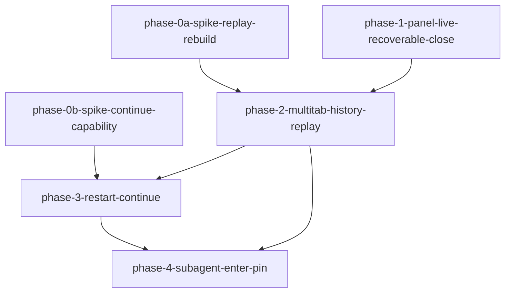

# Phase 拆分计划：vscode-dsh-conversation-ui

<!--
  slug: vscode-dsh-conversation-ui
  audience: orchestrator / implementer / reviewer / verifier / HG-2
  language: zh (canonical)
  design: design.md
  created: 2026-09-07
  revised: 2026-09-08 (R11 sync: 极薄 Webview; 空 Tab/恢复剔除; tabId; Diff before; 立即持久化; L2 钩子; 状态图; phase ids unchanged)
-->

## 总体策略

按**风险与 Spike Gate**切分：两个独立 Spike（T-0a 回放重建能力、T-0b 续写能力）与纯 live 产品 Phase **可并行**；含历史回放重建的 Phase **硬依赖 T-0a**；含「继续此会话」的切片 **硬依赖 T-0b**（**仅**阻塞 phase-3 Continue，**不**阻塞 phase-2）；Subagent 在回放基础设施就绪后交付（先读/回放，后钉 Tab）。

相对 requirements「建议四段」的微调理由：

1. **拆分 T-0a / T-0b 为两个 Spike Phase**（`phase-0a` / `phase-0b`），dependencies 皆空，可并行；避免单一 Spike 阻塞无关路径。
2. **phase-1 纯 live**（面板 + 可恢复关/删 + Timeline 弱化）**不依赖** Spike，尽快消除「关 Tab=dispose」与「无对话面板」主痛点；**须落地极薄 Webview + L2 测试钩子 + harness/冒烟**。
3. **回放 Diff / 不完整回合**与重启恢复、Continue 同放 **phase-3**（按产品指引；含空 Tab 恢复剔除、索引立即持久化、Diff before 权威快照），但 DAG 上 phase-3 依赖 phase-2（回放基础设施）+ phase-0b（Continue）；若 T-0b FAIL，phase-3 仍交付重启与 Diff/不完整，Continue 按 AD-CU-8 **隐藏**。
4. **phase-4 Subagent** 依赖 phase-2（回放/消息流）与 phase-3（恢复/继续策略一致 + Diff 行为），避免子会话续写语义分叉。

## Phase DAG



ASCII 等价（**0b → phase-3 only**，勿误读为阻塞 phase-2）：

```
phase-0a ──┐
           ├→ phase-2 ──┬→ phase-3 ──→ phase-4
phase-1 ───┘            │       ▲
                        │       │
phase-0b ───────────────┴───────┘   ← 0b → phase-3 only
```

## Phase 列表

| Phase | 名称 | 范围 | 依赖 | 验收标准数（约） |
|-------|------|------|------|:----------------:|
| 0a | Spike：回放重建能力（T-0a） | 无 UI；验证权威日志可否支撑消息流+Timeline 重建；选定读日志缝；写 Gate 报告 | 无 | Gate AC-80 + 证据 |
| 0b | Spike：续写能力（T-0b） | 无 UI；同 id 续写 vs 派生；continueCapability 探测；写 Gate 报告 | 无 | Gate AC-68 + 证据 |
| 1 | 面板 live + 可恢复关/删 + Timeline 弱化 | **极薄** Webview 消息流/发送；L2 Host 测试钩子；关 Tab≠dispose；空 Tab 不入 openTabSet；删除状态机；Timeline 无 assistant 长文；等待交互可见 | 无（可与 Spike 并行） | ~25 |
| 2 | 多 Tab 未读/审批队列 + 历史回放 | 未读/角标/串行队列；扩展索引历史列表；回放 Tab 重建（**需 T-0a PASS**） | 0a, 1 | ~20 |
| 3 | 重启恢复 + Diff/不完整 + 继续 | 未关 Tab 集恢复（限 N+查看更多；**空 Tab 剔除**；立即持久化）；回放 Diff（before 权威快照）/不完整；Should 继续（**需 T-0b**） | 2, 0b | ~15 |
| 4 | Subagent 进入与钉 Tab | 上下文进入、只读实时→自动回放、钉 Tab、父子已删导航 | 2, 3 | ~12 |

## DAG 任务编排（JSON）

```json
{
  "phases": [
    {
      "id": "phase-0a-spike-replay-rebuild",
      "name": "Spike：权威日志回放重建能力（T-0a）",
      "dependencies": [],
      "acceptance_criteria": ["AC-80", "AC-30", "AC-47", "AC-76", "AC-77"]
    },
    {
      "id": "phase-0b-spike-continue-capability",
      "name": "Spike：同 id 续写 / 派生能力（T-0b）",
      "dependencies": [],
      "acceptance_criteria": ["AC-68", "AC-32", "AC-66", "AC-67", "AC-28"]
    },
    {
      "id": "phase-1-panel-live-recoverable-close",
      "name": "对话面板 live + 可恢复关 Tab / 删除 + Timeline 弱化",
      "dependencies": [],
      "acceptance_criteria": [
        "AC-1", "AC-2", "AC-3", "AC-4", "AC-5", "AC-6", "AC-7", "AC-9", "AC-10", "AC-11", "AC-12", "AC-13",
        "AC-14", "AC-15", "AC-17", "AC-18", "AC-21", "AC-23", "AC-24", "AC-25", "AC-26",
        "AC-41", "AC-42", "AC-43", "AC-45", "AC-46", "AC-48", "AC-49", "AC-50", "AC-51", "AC-52", "AC-53",
        "AC-59", "AC-60", "AC-61", "AC-62", "AC-72", "AC-73", "AC-54", "AC-84"
      ]
    },
    {
      "id": "phase-2-multitab-history-replay",
      "name": "多 Tab 未读/审批串行 + 历史列表与回放重建",
      "dependencies": ["phase-0a-spike-replay-rebuild", "phase-1-panel-live-recoverable-close"],
      "acceptance_criteria": [
        "AC-19", "AC-20", "AC-22", "AC-28", "AC-29", "AC-30", "AC-31",
        "AC-47", "AC-56", "AC-57", "AC-58", "AC-63", "AC-64", "AC-65", "AC-16", "AC-54", "AC-80", "AC-84"
      ]
    },
    {
      "id": "phase-3-restart-continue",
      "name": "重启恢复未关 Tab + 回放 Diff/不完整 + 继续此会话",
      "dependencies": ["phase-2-multitab-history-replay", "phase-0b-spike-continue-capability"],
      "acceptance_criteria": [
        "AC-33", "AC-34", "AC-69", "AC-70", "AC-76", "AC-77",
        "AC-32", "AC-66", "AC-67", "AC-68", "AC-54", "AC-84"
      ]
    },
    {
      "id": "phase-4-subagent-enter-pin",
      "name": "Subagent 进入 / 钉 Tab / 父子已删导航",
      "dependencies": ["phase-2-multitab-history-replay", "phase-3-restart-continue"],
      "acceptance_criteria": [
        "AC-35", "AC-36", "AC-37", "AC-38", "AC-39", "AC-40", "AC-71",
        "AC-74", "AC-75", "AC-78", "AC-79", "AC-54", "AC-84"
      ]
    }
  ]
}
```

### Spike 如何挂 DAG

| Gate | Phase id | `dependencies` 消费方 | FAIL 时 |
|------|----------|----------------------|---------|
| T-0a | `phase-0a-spike-replay-rebuild` | `phase-2-…`（及传递依赖的 3/4 回放能力） | Phase 2 回放切片停工；phase-1 不受影响 |
| T-0b | `phase-0b-spike-continue-capability` | **仅** `phase-3-…` 的 Continue 切片（**不**进入 phase-2 依赖） | Continue 按 AD-CU-8 **隐藏**；重启恢复 + AC-76/77 仍可在 T-0a 已通过前提下交付 |

编排：HG-2 后可并行启动 `phase-0a`、`phase-0b`、`phase-1`。`phase-2` 须等 **仅** 0a **PASS** + phase-1（**不等** 0b）。`phase-3` 须等 phase-2 + 0b（0b FAIL 则 Continue 隐藏说明）。Spike PASS 报告须含「对相关 AD-CU 的更新建议」，确认后回填 `design.md` 修订记录。

## 每个 Phase 的详细说明

### phase-0a-spike-replay-rebuild

- **目标:** 实证权威会话日志能否支撑 AC-30/47/76/77；选定读日志缝；产出 Gate 报告（PASS/FAIL + 证据）。无产品 UI。
- **输入:** requirements T-0a、AC-80；design AD-CU-2、Spike 节
- **产出:** `spike-report.md` + 可重复脚本；下游组件名 **ReplayHydrator**
- **验收:** 见 `phases/phase-0a-spike-replay-rebuild/spec.md`（含验证策略表）

### phase-0b-spike-continue-capability

- **目标:** 实证同 id 续写 vs 派生；continueCapability 探测方案；Gate 报告。无产品 UI。
- **输入:** requirements T-0b、AC-68；design AD-CU-8
- **产出:** spike-report + 探测 API 草图
- **验收:** 见对应 spec.md

### phase-1-panel-live-recoverable-close

- **目标:** **极薄**对话面板 live；关 Tab 可恢复；删除状态机；Timeline 弱化；等待交互可见；同会话单 live；tabId 生命周期。
- **输入:** design AD-CU-1/3/4/5/6/9/12（极薄 Webview、空 Tab 不入 openTabSet、立即持久化、tabId）
- **产出:** 极薄 chat webview、MessageStore、controller/registry/README；**L2 Host 测试钩子**（例 `dsh.test.sendPrompt`）+ **L2 harness + 最小冒烟必须落地**；L1+L3（模拟 Webview）证据面
- **验收:** 见 `phases/phase-1-panel-live-recoverable-close/spec.md`
- **注:** **不**实现历史回放重建 UI

### phase-2-multitab-history-replay

- **目标:** 未读/审批串行；历史列表；`ReplayHydrator` 一次性全量回放重建。
- **前置 Gate:** T-0a PASS
- **第一步:** 现状阅读既有 `InteractionCoordinator`（单弹层 vs 队列）→ 再按 AD-CU-7 并入扩展（禁止新建 `interaction-queue.ts`）
- **验收:** 见对应 spec.md

### phase-3-restart-continue

- **目标:** 重启恢复（活动恒优先；空 Tab 剔除；索引立即持久化）；回放 Diff（before 权威快照）/不完整；Should Continue（T-0b；同打开期原位 `replay→live`；映射见 AD-CU-8）。
- **输入:** design AD-CU-3/4/5/6/8/10
- **验收:** 见对应 spec.md

### phase-4-subagent-enter-pin

- **目标:** 进入子会话；只读实时→自动回放；钉 Tab；父子已删导航。
- **验收:** 见对应 spec.md

## 跨 Phase 验证清单（AC-54）

产品 Phase 达标须 **L2**（可脱离 Webview 的 Host 测试钩子）+ 适用 **L3（模拟 Webview 客户端，非 HTML/CSP/渲染）** 可脚本证据（见 `design.md`「验收标准验证方案」）。Spike 允许纯脚本 Gate；PASS 报告须含 AD-CU 更新建议。

| 路径 | 最晚覆盖 Phase |
|------|----------------|
| 面板发送 → 用户/助手消息 | phase-1 |
| 切 Tab → 面板切换 | phase-1 |
| 关 Tab → 历史可回放打开 | phase-2 |
| 删除 → 不可再回放正文 | phase-1（删除）+ phase-2（历史缺席） |
| 重启恢复 Tab 集 | phase-3 |
| 进入子会话 | phase-4 |

## 不纳入任何 Phase Must

Spec 面板、hooks 包、GAP-010/011、审批表单重做、跨工作区历史、S-20 后台跑完、Cursor 级 Chat UX（Could）。
