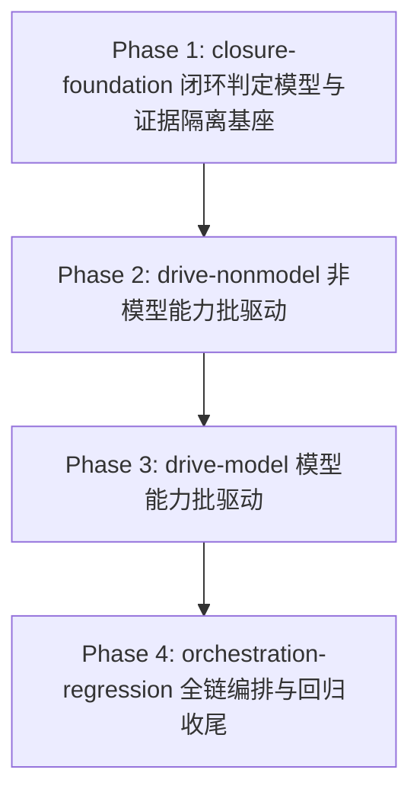

# Phase 拆分计划 — vscode-dsh 功能能力真机端到端闭环验证（重做）

> 工作流 slug：`vscode-dsh-e2e-closure`。本文档由 plan-generator 产出，Phase ID 是后续所有阶段（current_phase / 分支名 / spec 路径）的**唯一真相源**，任何 Agent 或调度者不得另起名字。

## 总体策略

本工作流核心交付物是「可重复运行的真机闭环验证基座」，对当前代码真实实现的 41 项能力逐项真机驱动、给结论（闭环通过 / 未闭环 + 缺口三元组），不补齐缺口（AC-15）。拆分遵循「先立框架/补判定原语 → 逐能力驱动 → 回归护栏与 registry 收尾」三段式，共 4 个 Phase，线性 DAG：

1. **Phase 1（基座）**：落地「真闭环判定」机器可读结论模型（`closedLoop` 三元组 + 弱证据识别）+ per-run 证据隔离（R3）。这是后续所有驱动的前提，无模型依赖、纯代码/编排改造。
2. **Phase 2（非模型能力批）**：对 `requiresModel: false` 的能力逐项驱动，升级弱证据为具体结果断言（能闭环则闭环、不能则登记）。**不依赖真实 key，运行快**，用来校准 Phase 1 的判定与隔离，并验证「逐项给结论」范式。
3. **Phase 3（模型能力批）**：对 `requiresModel: true` 的能力逐项驱动，强制真实 LLM 往返（AC-9）+ 无 key fail-closed（AC-10），并完成 React SPA 呈现路径（含历史窗口）的闭环（AC-11）。**运行昂贵，显式串行在 Phase 2 之后**，避免在昂贵运行上反复试错。
4. **Phase 4（全链编排 + 回归护栏 + 收尾）**：一条命令串起全链 + artifact-index + closure 汇总；跑既有回归护栏（AC-12）；资产归属（AC-13）；诚实报告收尾 + `tech-debt-registry.md` 更新（AC-14，DEBT-1 归档、DEBT-4/5 更新、陈旧回归脚本处理）。

> 运行时长风险（R1）应对：Phase 3 支持 `--capability` 分批与基于 per-run 目录 + artifact-index 的断点续跑；Phase 2/3 的验证在 spec 中按「组」分批设计。

## Phase DAG



## Phase 列表

| Phase | id | 名称 | 范围 | 依赖 | AC |
|-------|----|------|------|------|:--:|
| Phase 1 | `phase-1-closure-foundation` | 闭环判定模型与证据隔离基座 | `closedLoop` 判定 + 弱证据识别 + per-run 隔离 + journal/退出码契约 | 无 | AC-1, AC-2, AC-5, AC-7, AC-8 |
| Phase 2 | `phase-2-drive-nonmodel` | 非模型能力批真机驱动 | 18 项 `requiresModel:false` 能力逐项驱动 + 弱证据升级 + 过时清单 | Phase 1 | AC-3, AC-4, AC-6, AC-15 |
| Phase 3 | `phase-3-drive-model` | 模型能力批真机驱动 | 23 项 `requiresModel:true` 能力 + 真实 LLM + fail-closed + React SPA 呈现路径 | Phase 2 | AC-6, AC-9, AC-10, AC-11, AC-15 |
| Phase 4 | `phase-4-orchestration-regression` | 全链编排与回归收尾 | 全链入口 + artifact-index + 回归护栏 + registry 收尾 | Phase 3 | AC-12, AC-13, AC-14, AC-6, AC-15 |

> AC-6 与 AC-15 是横切 AC：AC-6「每一项能力产出截图 + 断言」、AC-15「逐项驱动给结论 + 基座为核心交付物」分别由 Phase 2（非模型批）、Phase 3（模型批）各验收本批子集，Phase 4 做全链终验。各 Phase 的 spec 明确「本 Phase 只验收本批能力」。

## DAG 任务编排（JSON）

```json
{
  "slug": "vscode-dsh-e2e-closure",
  "phases": [
    {
      "id": "phase-1-closure-foundation",
      "name": "闭环判定模型与证据隔离基座",
      "ui": false,
      "dependencies": [],
      "acceptance_criteria": ["AC-1", "AC-2", "AC-5", "AC-7", "AC-8"]
    },
    {
      "id": "phase-2-drive-nonmodel",
      "name": "非模型能力批真机驱动",
      "ui": false,
      "dependencies": ["phase-1-closure-foundation"],
      "acceptance_criteria": ["AC-3", "AC-4", "AC-6", "AC-15"]
    },
    {
      "id": "phase-3-drive-model",
      "name": "模型能力批真机驱动",
      "ui": false,
      "dependencies": ["phase-2-drive-nonmodel"],
      "acceptance_criteria": ["AC-6", "AC-9", "AC-10", "AC-11", "AC-15"]
    },
    {
      "id": "phase-4-orchestration-regression",
      "name": "全链编排与回归收尾",
      "ui": false,
      "dependencies": ["phase-3-drive-model"],
      "acceptance_criteria": ["AC-12", "AC-13", "AC-14", "AC-6", "AC-15"]
    }
  ]
}
```

> 全部 `ui: false`：本工作流不新增/修改任何产品 UI 视图文件，交付物是验证基础设施（bash + CJS 驱动 + 断言），截图是验证证据而非「被设计的界面」（`requirements.md` §UI 相关性）。

## 每个 Phase 的详细说明

### Phase 1: 闭环判定模型与证据隔离基座

- **目标**：在 `capability-runner.cjs` 落地 `closedLoop` 三元组判定与弱证据识别（`classifyAssertionStrength`/`assessClosedLoop`），在 `run-layer-v-capabilities.sh` 落地 per-run 证据隔离，确认 journal 逐步追加与退出码契约不破坏。
- **输入**：`requirements.md` AC-1/2/5/7/8；`design.md` §核心实体/数据模型、§API 域；`repo-exploration.md` §6（退出码契约、共享原语、journal）。
- **产出**：扩展后的 `capability-runner.cjs`；改造后的 `run-layer-v-capabilities.sh`；本工作流 `artifact-index.md` 模板（可延后到 Phase 4，但建好更稳）；对应 `layer-v-capabilities-status.json` 携带 `closedLoop`。
- **验收**：见 `phases/phase-1-closure-foundation/spec.md`。

### Phase 2: 非模型能力批真机驱动

- **目标**：对 `requiresModel:false` 的 18 项能力（`react-spa-main` 8 + `editor-panel` 4 + `code-context` 的 at-path/workspace-path 2 + `interaction` 2 + `test-hooks` 1 + `extension-activate` 1）逐项真机驱动；把弱证据 `panelOpen:true` 升级为具体结果断言；能闭环则闭环、不能则登记「未闭环 + 三元组」；产出过时功能清单。
- **输入**：`requirements.md` AC-3/4/6/15；`design.md` §能力分批；`repo-exploration.md` §3/§12。
- **产出**：`layer-v-capabilities.json` 本批组的断言升级；本批能力的 status（含 `closedLoop`）+ 截图 + journal；过时功能清单；registry 新增「未闭环」条目（如有）。
- **验收**：见 `phases/phase-2-drive-nonmodel/spec.md`。

### Phase 3: 模型能力批真机驱动

- **目标**：对 `requiresModel:true` 的 23 项能力逐项真机驱动，强制真实 `DEEPSEEK_API_KEY` 往返（AC-9），无 key 时 fail-closed exit 3（AC-10）；完成 React SPA 呈现路径（编辑器区单例 Panel、顶栏多 Tab、历史窗口）的截图 + 断言闭环（AC-11）；能闭环则闭环、不能则登记。
- **输入**：`requirements.md` AC-6/9/10/11/15；`design.md` §能力分批。
- **产出**：本批能力的 status（含 `closedLoop`）+ 截图 + journal；`cap-selection-ask` 的负向 run 证据（exit 3）；registry 新增/更新「未闭环」条目。
- **验收**：见 `phases/phase-3-drive-model/spec.md`。

### Phase 4: 全链编排与回归收尾

- **目标**：新增 `run-vscode-dsh-e2e-closure.sh` 全链入口（全量驱动 + closure 汇总 + artifact-index 追加）；跑既有回归护栏（`vitest run apps/vscode-dsh/tests` + 既有冒烟脚本）；确认资产归属（AC-13）；诚实报告收尾 + `tech-debt-registry.md` 更新（DEBT-1 归档、DEBT-4/5 更新、陈旧 `run-chat-ready-regression.sh` 处理）。
- **输入**：`requirements.md` AC-12/13/14 + AC-6/15（终验）；`design.md` §高风险子系统；`tech-debt-registry.md`。
- **产出**：`run-vscode-dsh-e2e-closure.sh`；全链 closure 汇总报告；更新后的 registry；回归护栏通过证据。
- **验收**：见 `phases/phase-4-orchestration-regression/spec.md`。
