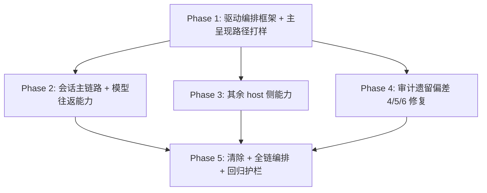

# Phase 拆分计划 — vscode-dsh-e2e-closure

## 总体策略

按「框架先立、能力后铺、债务并行、清理收尾」拆分 5 个 Phase：

1. **先立框架 + 打样**（Phase 1）：复用 `run-layer-v-smoke.sh` 提取共享运行时库，建立多能力驱动编排框架 + 机器可读能力清单，用 editor-chat-panel 主呈现路径打样出「操作序列 + 截图 + 断言」范式 —— 这是后续所有能力驱动的骨架，也是偏差 4（editor-chat-panel 层 V 视觉证据）的直接产出。
2. **能力分批并行**（Phase 2 / 3）：二者均依赖 Phase 1、彼此无依赖，可并行。Phase 2 收敛「会话/聊天主链路 + 模型往返能力」（真实 LLM 强制，AC-9 的核心载体）；Phase 3 收敛其余 host 侧能力。分批是应对风险 R1（单次 25 分钟）的手段。
3. **债务并行**（Phase 4）：偏差 5/6 是纯代码修复，与能力驱动无代码交集，可在 Phase 1 之后并行推进（依赖 Phase 1 仅因偏差 4 的截图证据由打样产出）。
4. **清除 + 编排 + 回归收尾**（Phase 5）：依赖 Phase 2/3/4，在全部代码改动落地后做清除（防误删需回归护栏兜底）与全链编排（AC-17/18），最后跑回归护栏（AC-19）。

**依赖关系**：Phase 2/3/4 均依赖 Phase 1（框架/清单/打样），Phase 5 依赖 Phase 2/3/4。Phase 2/3/4 可并行。

## Phase DAG



## Phase 列表

| Phase | 名称 | 范围 | 依赖 | 验收标准数 |
|-------|------|------|------|:--------:|
| phase-1-driver-framework-pilot | 层 V 多能力驱动编排框架 + 主呈现路径打样 | 提取共享运行时库、能力清单 manifest、编排脚本、多能力驱动扩展、editor-chat-panel 打样 | 无 | 6 |
| phase-2-session-main-path-llm | 会话/聊天主链路与模型往返能力真机驱动 | §12.3 会话主链路 + §12.8 分叉 + §12.9 Continue（真实 LLM） | Phase 1 | 4 |
| phase-3-remaining-capabilities | 其余 host 侧能力逐项真机驱动 | §12.4/12.5/12.6/12.7/12.10/12.11 | Phase 1 | 4 |
| phase-4-audit-debt-fixes | 审计遗留偏差 4/5/6 修复 | 偏差 5 lib chunk、偏差 6 FiberState、偏差 4 三文件声明 | Phase 1 | 3 |
| phase-5-cleanup-orchestration-regression | 清除过时产物 + 全链编排 + 回归护栏 | mock/过时产物清除、全链编排、回归护栏 | Phase 2, 3, 4 | 6 |

## DAG 任务编排（JSON）

```json
{
  "phases": [
    {
      "id": "phase-1-driver-framework-pilot",
      "name": "层 V 多能力驱动编排框架 + 主呈现路径打样",
      "ui": false,
      "dependencies": [],
      "acceptance_criteria": ["AC-1", "AC-2", "AC-3", "AC-4", "AC-5", "AC-6"]
    },
    {
      "id": "phase-2-session-main-path-llm",
      "name": "会话/聊天主链路与模型往返能力真机驱动",
      "ui": false,
      "dependencies": ["phase-1-driver-framework-pilot"],
      "acceptance_criteria": ["AC-7", "AC-8", "AC-9", "AC-10"]
    },
    {
      "id": "phase-3-remaining-capabilities",
      "name": "其余 host 侧能力逐项真机驱动",
      "ui": false,
      "dependencies": ["phase-1-driver-framework-pilot"],
      "acceptance_criteria": ["AC-7", "AC-8", "AC-9", "AC-10"]
    },
    {
      "id": "phase-4-audit-debt-fixes",
      "name": "审计遗留偏差 4/5/6 修复",
      "ui": false,
      "dependencies": ["phase-1-driver-framework-pilot"],
      "acceptance_criteria": ["AC-11", "AC-12", "AC-13"]
    },
    {
      "id": "phase-5-cleanup-orchestration-regression",
      "name": "清除过时产物 + 全链编排 + 回归护栏",
      "ui": false,
      "dependencies": ["phase-2-session-main-path-llm", "phase-3-remaining-capabilities", "phase-4-audit-debt-fixes"],
      "acceptance_criteria": ["AC-14", "AC-15", "AC-16", "AC-17", "AC-18", "AC-19"]
    }
  ]
}
```

## 每个 Phase 的详细说明

### Phase 1: 层 V 多能力驱动编排框架 + 主呈现路径打样

- **目标**：复用基座，建立可承载 41 项能力的「多能力驱动编排」框架，用 editor-chat-panel 主呈现路径（§12.1/§12.2）打样。
- **输入**：requirements.md §AC-1~AC-6；repo-exploration.md §3/§4/§6/§12.1/§12.2。
- **产出**：`layer-v-support/layer-v-runtime.sh`、`layer-v-capabilities.json`、`run-layer-v-capabilities.sh`、`layer-v-capability-driver/`（三文件）；`run-layer-v-smoke.sh` 改为 source 共享库（行为保持）。
- **验收**：AC-1（复用不重造）、AC-2（Xvfb 自动拉起 + fail-closed）、AC-3（JSONL journal）、AC-4（截图 + md5 非退化）、AC-5（退出码契约）、AC-6（manifest 与 §12 一一对应）。

### Phase 2: 会话/聊天主链路与模型往返能力真机驱动

- **目标**：对 §12.3（会话主链路：建连/就绪/消息往返/流式呈现）+ §12.8 分叉 + §12.9 Continue 建立真机驱动，强制真实 LLM 往返。
- **输入**：Phase 1 框架 + manifest；requirements.md §AC-7~AC-10。
- **产出**：manifest 中该批能力的 `steps` 与断言实现 + 对应截图/证据。
- **验收**：AC-7（会话主链路覆盖）、AC-8（不覆盖 thin HTML）、AC-9（真实 LLM）、AC-10（端到端断言完整数据路径）。

### Phase 3: 其余 host 侧能力逐项真机驱动

- **目标**：对 §12.4（子会话/钉 Tab）、§12.5（代码上下文）、§12.6（变更列表）、§12.7（搜索）、§12.10（历史）、§12.11（交互审批）建立真机驱动 + 断言。
- **输入**：Phase 1 框架 + manifest；requirements.md §AC-7~AC-10。
- **产出**：manifest 中该批能力的 `steps` 与断言实现 + 对应截图/证据。
- **验收**：AC-7（剩余能力覆盖）、AC-8、AC-10；涉及模型往返的能力（如选区提问）继承 AC-9 真实 LLM 要求。

### Phase 4: 审计遗留偏差 4/5/6 修复

- **目标**：实际修复偏差 5（lib 陈旧 chunk + files 字段）、偏差 6（const enum → enum + vendor 记录 + registry 登记）、偏差 4（三文件处理方式声明）。
- **输入**：requirements.md §AC-11~AC-13；repo-exploration.md §偏差 5/6。
- **产出**：`tsdown.config.ts`、`package.json`、`vendor/cordis/src/fiber.ts`、`vendor/README.md`、`tech-debt-registry.md` 的修改。
- **验收**：AC-11（偏差 4 证据 + 三文件声明）、AC-12（偏差 5 修复）、AC-13（偏差 6 修复 + 登记）。

### Phase 5: 清除过时产物 + 全链编排 + 回归护栏

- **目标**：按清单清除 mock/过时测试/过时验证产物（留痕），串起全链编排，产出统一状态记录 + artifact-index，跑回归护栏。
- **输入**：Phase 2/3/4 产物；requirements.md §AC-14~AC-19；repo-exploration.md §14。
- **产出**：清除动作 + implementation.md 留痕；全链编排命令；回归护栏运行记录。
- **验收**：AC-14~AC-19。
