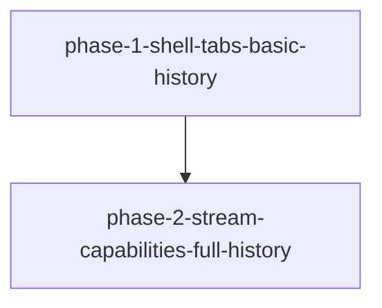

# Phase 拆分计划（中文镜像）

> Canonical：[`phase-plan.md`](./phase-plan.md)。

## 总体策略

**2 Phase**（AC-43）。P1 起 React 主路径，禁止先内联再 React。不拆 3：脚手架与壳/Tab/基础历史强耦合，单独 Phase 难验收可聊主面。

## Phase DAG



## DAG JSON（与 canonical 一致）

```json
{
  "phases": [
    {
      "id": "phase-1-shell-tabs-basic-history",
      "name": "React壳 + 顶栏Tab + 基础历史 + 最小可聊",
      "dependencies": [],
      "acceptance_criteria": [
        "AC-1", "AC-1b", "AC-1c", "AC-1d", "AC-1e", "AC-1f", "AC-2", "AC-3", "AC-4", "AC-5",
        "AC-10", "AC-10a", "AC-10b", "AC-10c", "AC-11", "AC-11a", "AC-11b", "AC-12",
        "AC-13", "AC-13a", "AC-13b", "AC-14", "AC-14c", "AC-15", "AC-16",
        "AC-40", "AC-42", "AC-43",
        "AC-50", "AC-50a", "AC-51", "AC-52", "AC-58",
        "UI-AC-1", "UI-AC-2", "UI-AC-3", "UI-AC-10", "UI-AC-11", "UI-AC-12", "UI-AC-13",
        "UI-AC-40", "UI-AC-41", "UI-AC-60", "UI-AC-61",
        "AD-ECP-8", "AD-ECP-10-P1"
      ]
    },
    {
      "id": "phase-2-stream-capabilities-full-history",
      "name": "可读流 + 能力 + 完整历史 + 退役内联",
      "dependencies": ["phase-1-shell-tabs-basic-history"],
      "acceptance_criteria": [
        "AC-13c", "AC-14a", "AC-14b",
        "AC-20", "AC-20a", "AC-20b", "AC-21", "AC-21a", "AC-22", "AC-23", "AC-23a", "AC-24", "AC-25",
        "AC-30", "AC-30a", "AC-31", "AC-31a", "AC-32", "AC-32a",
        "AC-33", "AC-33a", "AC-33b", "AC-34", "AC-34a", "AC-34b", "AC-35",
        "AC-36", "AC-36a", "AC-37", "AC-37a", "AC-38", "AC-38a", "AC-38b",
        "AC-40", "AC-41", "AC-42", "AC-44", "AC-45",
        "AC-53", "AC-54", "AC-55", "AC-56", "AC-57", "AC-59", "AC-60",
        "UI-AC-20", "UI-AC-21", "UI-AC-22", "UI-AC-23", "UI-AC-24",
        "UI-AC-30", "UI-AC-31", "UI-AC-32",
        "UI-AC-40", "UI-AC-42", "UI-AC-43",
        "UI-AC-50", "UI-AC-51", "UI-AC-52",
        "UI-AC-60", "UI-AC-61", "UI-AC-62",
        "AD-ECP-10-P2"
      ]
    }
  ]
}
```

## 修订

2026-09-13：React 主路径重排；论证保留 2 Phase。
