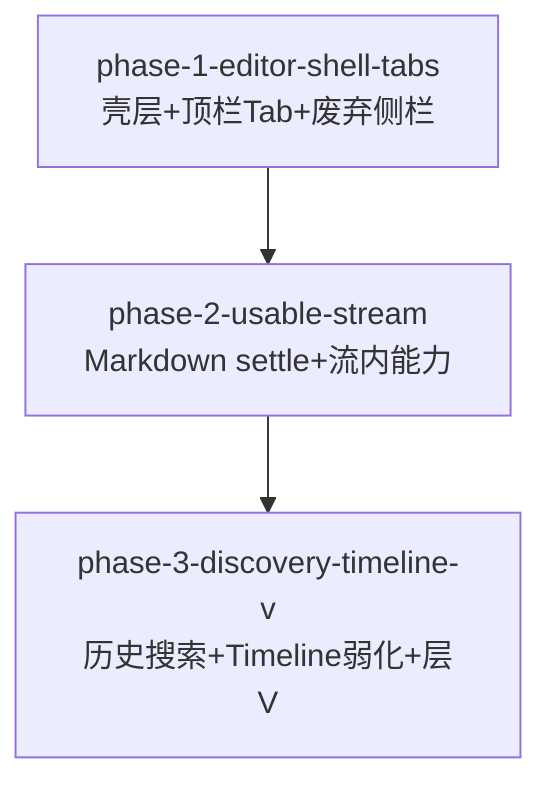

# Phase 拆分计划

<!--
  slug: vscode-dsh-editor-chat-panel
  AC-43: 2–3 Phase only
  created: 2026-09-11
-->

## 总体策略

按「用户一次能感到什么变了」切 **3** 个 Phase（不按技术模块拆碎）：

1. **壳 + Tab**：对话主面出现在编辑器区，顶栏能切换/新建，侧栏主聊天消失。
2. **可读日常聊**：settle 后 Markdown、活动/引用/变更、发送/停止像正经聊天。
3. **发现与弱化收齐**：历史/搜索顶栏 UI、fork/重试/复制入口、Timeline 默认隐藏、层 V 全清单。

线性依赖：后一 Phase 建立在前一 Phase 的唯一 Panel 壳之上。

## Phase DAG



## Phase 列表

| Phase | ID | 范围 | 依赖 | 验收标准数 |
|-------|-----|------|------|:--------:|
| Phase 1 | `phase-1-editor-shell-tabs` | F0 + F1 + 最小可聊 composer | 无 | 14 |
| Phase 2 | `phase-2-usable-stream` | F2 + F3 核心呈现（活动/引用/变更/停止） | Phase 1 | 12 |
| Phase 3 | `phase-3-discovery-timeline-v` | F3 收尾（历史/搜索/fork/复制）+ F4 + Timeline 弱化 | Phase 2 | 12 |

> AC-43 由本计划自身满足（恰好 3 Phase）。AC-40–42 的「每 Phase 层 V」分摊到各 Phase spec。

## DAG 任务编排（JSON）

```json
{
  "phases": [
    {
      "id": "phase-1-editor-shell-tabs",
      "name": "编辑器壳层与顶栏多会话 Tab",
      "dependencies": [],
      "acceptance_criteria": [
        "AC-1",
        "AC-2",
        "AC-3",
        "AC-4",
        "AC-5",
        "AC-10",
        "AC-11",
        "AC-12",
        "AC-13",
        "AC-15",
        "AC-16",
        "AC-33",
        "AC-40",
        "AC-41"
      ]
    },
    {
      "id": "phase-2-usable-stream",
      "name": "可用级消息流与流内能力呈现",
      "dependencies": ["phase-1-editor-shell-tabs"],
      "acceptance_criteria": [
        "AC-20",
        "AC-21",
        "AC-22",
        "AC-23",
        "AC-24",
        "AC-25",
        "AC-30",
        "AC-31",
        "AC-32",
        "AC-33",
        "AC-40",
        "AC-41"
      ]
    },
    {
      "id": "phase-3-discovery-timeline-v",
      "name": "历史搜索入口、Timeline 弱化与层 V 收齐",
      "dependencies": ["phase-2-usable-stream"],
      "acceptance_criteria": [
        "AC-14",
        "AC-34",
        "AC-35",
        "AC-36",
        "AC-37",
        "AC-38",
        "AC-40",
        "AC-41",
        "AC-42",
        "AC-43",
        "AC-44"
      ]
    }
  ]
}
```

## 每个 Phase 的详细说明

### Phase 1: 编辑器壳层与顶栏多会话 Tab

- **目标**: 用户打开 Conversation 即进入编辑器区宽面；顶栏可切换/新建/关闭 Tab；侧栏不再有可读写主聊天面。
- **输入**: requirements.md §F0/F1；design.md AD-ECP-1/2；`chat-panel-*` / `conversation-tab-bar` / Registry。
- **产出**: 单例 WebviewPanel；`panel/tabs`；TreeView Tab 主路径降级；最小 composer 可对活动会话发送。
- **验收**: AC-1…5, 10…13, 15, 16, 33（发送门闩可用）, 40, 41（V-1…V-4）。
- **用户体感**: 「聊天窗口跑到编辑器中间了，上面有多会话 Tab」。

### Phase 2: 可用级消息流与流内能力呈现

- **目标**: settle 后 Markdown 可读；生成中/停止/跟滚正确；活动、引用、变更在流内可见；composer 停止走 I-真。
- **输入**: Phase 1 壳；`safe-markdown`；既有 activity/ref/change DOM。
- **产出**: streaming→settle MD 重渲；流内信息层级可用级；Stop 完整。
- **验收**: AC-20…25, 30…33, 40, 41（含 V-5…V-7）。
- **用户体感**: 「能像日常一样读回复、看工具步骤和改动、敢点停止」。

### Phase 3: 历史搜索入口、Timeline 弱化与层 V 收齐

- **目标**: 顶栏历史/搜索 UI 为主入口；fork/重试/复制可发现；Timeline 默认隐藏/折叠；层 V 全清单可过。
- **输入**: Phase 2 流；Host search/fork/copy deps；design AD-ECP-3/4。
- **产出**: 面板内历史/搜索 UI；溢出菜单；Timeline visibility；verification 层 V 全表。
- **验收**: AC-14, 34…38, 40…44。
- **用户体感**: 「能搜历史、分叉重试都找得到；Timeline 不再抢主视线」。

## 不在本 plan 拆出的项（禁止再拆 Phase）

- 搜索档 3、thinking UI、truncate/rewind、像素 redesign、重写协议栈（见 requirements 不在范围内）。
