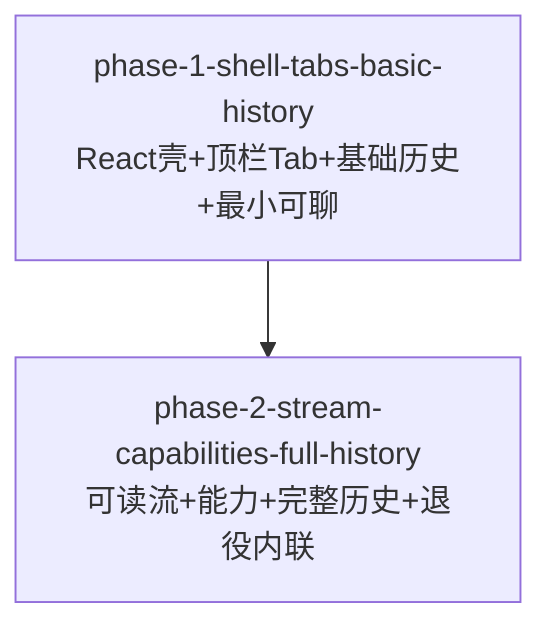

# Phase 拆分计划

<!--
  slug: vscode-dsh-editor-chat-panel
  companion: design.md
  status: rewrite 2026-09-13 — React webview 主路径（AD-ECP-8 superseded）
  language: zh (canonical). Mirror: phase-plan-zh.md
-->

## 总体策略

按「用户一次能感到什么变了」切 **2 个 Phase**（AC-43；禁止 5+）：

1. **Phase 1**：Editor WebviewPanel 单例 + Q-5/Q-7 + 废弃侧栏主聊 + **React+Vite 脚手架** + CSP/Bridge/DOM 契约/探针 + 顶栏 Tab + 最小可聊 + 历史入口→基础列表（AC-50a）+ 新层 A 冒烟 + ≥1 层 V + UI UF0/UF1/UF4 骨架。
2. **Phase 2**：可读消息流 + 活动/引用/变更 + composer 四态 + 复制/fork/Continue + 完整历史（AC-60 等）+ Timeline 弱化 + 层 V 全清单 + **内联 `buildThinChatHtml` 退出主路径**。

**明确不做**：「先内联改视觉再 React」。P1 起主路径即为 React。

**P1 豁免 / 先建后拆 / 打包 CI**：见 `design.md` AD-ECP-10 / 实现方案；phase-1 `spec.md` 已摘录。

**为何仍 2 Phase（不拆 3）**：

| 若拆 3 Phase | 问题 |
|--------------|------|
| P1 仅脚手架+壳，P2 才 Tab/历史 | 中间 HG-3 难验收「可聊主面」；AC-50a/顶栏与壳强耦合 |
| 脚手架单独成 Phase | 违反 §7.5「用户一次能感到什么变了」；流程开销大于体量 |

React 引入成本由 P1 吸收（脚手架+契约+最小可聊同交付），P2 专注能力与完整历史——2 Phase 足够，风险可控。

**UI**：每 Phase 绑定 `requirements-ui.md` 与 `ui-visual-spec.md` §9。

旧 3 Phase ID 仍作废；本 DAG JSON 的 `phases[].id` 为唯一真相源（ID 保留，内容改为 React）。

## Phase DAG



## Phase 列表

| Phase | 名称 | 范围 | 依赖 | 验收标准数（功能+UI） |
|-------|------|------|------|:---------------------:|
| Phase 1 | React 壳 + 顶栏 Tab + 基础历史 | F0 + F1 核心 + F5 骨架 + React 基建 + UF0/UF1/UF4 骨架 | 无 | ~22 功能 + ~10 UI |
| Phase 2 | 可读流 + 能力 + 完整历史 | F2 + F3 + F5 完整 + F4 + UF2–UF5 + 内联退役 | Phase 1 | ~35 功能 + ~15 UI |

## DAG 任务编排（JSON）

```json
{
  "phases": [
    {
      "id": "phase-1-shell-tabs-basic-history",
      "name": "React壳 + 顶栏Tab + 基础历史 + 最小可聊",
      "dependencies": [],
      "acceptance_criteria": [
        "AC-1", "AC-1b", "AC-1c", "AC-1d", "AC-1e", "AC-1f", "AC-2", "AC-3", "AC-4", "AC-5",
        "AC-10", "AC-10a", "AC-10b", "AC-10c", "AC-11", "AC-11a", "AC-11b", "AC-12",
        "AC-13", "AC-13a", "AC-13b", "AC-14", "AC-14c", "AC-15", "AC-16",
        "AC-40", "AC-42", "AC-43",
        "AC-50", "AC-50a", "AC-51", "AC-52", "AC-58",
        "UI-AC-1", "UI-AC-2", "UI-AC-3", "UI-AC-10", "UI-AC-11", "UI-AC-12", "UI-AC-13",
        "UI-AC-40", "UI-AC-41", "UI-AC-60", "UI-AC-61",
        "AD-ECP-8", "AD-ECP-10-P1"
      ]
    },
    {
      "id": "phase-2-stream-capabilities-full-history",
      "name": "可读流 + 能力 + 完整历史 + 退役内联",
      "dependencies": ["phase-1-shell-tabs-basic-history"],
      "acceptance_criteria": [
        "AC-13c", "AC-14a", "AC-14b",
        "AC-20", "AC-20a", "AC-20b", "AC-21", "AC-21a", "AC-22", "AC-23", "AC-23a", "AC-24", "AC-25",
        "AC-30", "AC-30a", "AC-31", "AC-31a", "AC-32", "AC-32a",
        "AC-33", "AC-33a", "AC-33b", "AC-34", "AC-34a", "AC-34b", "AC-35",
        "AC-36", "AC-36a", "AC-37", "AC-37a", "AC-38", "AC-38a", "AC-38b",
        "AC-40", "AC-41", "AC-42", "AC-44", "AC-45",
        "AC-53", "AC-54", "AC-55", "AC-56", "AC-57", "AC-59", "AC-60",
        "UI-AC-20", "UI-AC-21", "UI-AC-22", "UI-AC-23", "UI-AC-24",
        "UI-AC-30", "UI-AC-31", "UI-AC-32",
        "UI-AC-40", "UI-AC-42", "UI-AC-43",
        "UI-AC-50", "UI-AC-51", "UI-AC-52",
        "UI-AC-60", "UI-AC-61", "UI-AC-62",
        "AD-ECP-10-P2"
      ]
    }
  ]
}
```

> 注：`AD-ECP-8` / `AD-ECP-10-P*` 为设计验收锚点（非 requirements AC 编号），供 reviewer 对照 design 专章。

## 每个 Phase 的详细说明

### Phase 1: React 壳 + 顶栏 Tab + 基础历史 + 最小可聊

- **目标**：用户主动打开即得到编辑器区 React 主对话面；顶栏多 Tab；关 Panel 不误杀 running；历史入口非空窗；既有 send/stream 能通；验证基建就绪。
- **输入**：`requirements.md` F0/F1/F5 骨架；`requirements-ui.md` UF0/UF1/UF4；`ui-visual-spec.md` §3/§5.1/§5.5/§9 Phase1；`design.md` AD-ECP-1…5, **8, 9, 10**。
- **产出**：`webview/` SPA；`EditorChatPanelController`；Bridge+探针+DOM 契约；顶栏；历史骨架；侧栏降级；RTL 层 A 冒烟；≥1 层 V；`buildThinChatHtml` deprecated。
- **验收**：见 `phases/phase-1-shell-tabs-basic-history/spec.md`。
- **明确延后到 Phase 2**：AC-13c/14a/14b、F2 可读升级、F3 能力闭环、AC-53–57/59/60、AC-41 完整四态、内联主路径删除。

### Phase 2: 可读流 + 能力 + 完整历史 + 退役内联

- **目标**：日常敢用；历史完整；删除一致；层 V 收齐；内联退出主路径。
- **输入**：Phase 1 已合并；F2/F3/F4/F5 完整；UF2–UF5；视觉 §5.2–5.5、§9 Phase2+收尾；AD-ECP-6/7/10。
- **产出**：MD settle；能力入口；完整历史+AC-60；Timeline 弱化；层 V 全清单；内联仅 stub 或删除。
- **验收**：见 `phases/phase-2-stream-capabilities-full-history/spec.md`。

## 旧 Phase 映射（作废）

| 旧 ID | 处置 |
|-------|------|
| `phase-1-editor-shell-tabs` | OBSOLETE |
| `phase-2-usable-stream` | OBSOLETE |
| `phase-3-discovery-timeline-v` | OBSOLETE |

本轮保留 ID `phase-1-shell-tabs-basic-history` / `phase-2-stream-capabilities-full-history`，**内容已改为 React 主路径**（非内联）。

## 修订记录

| 日期 | 变更 |
|------|------|
| 2026-09-13 | 2 Phase；F5/AC-50a、E16、UI |
| 2026-09-13 | **React 主路径重排**：P1 含脚手架/Bridge/契约；P2 含内联退役；论证不采用 3 Phase |
