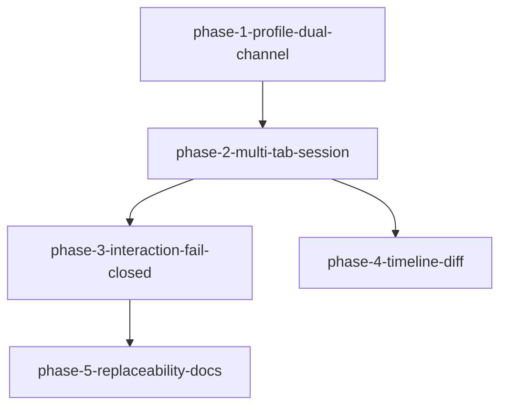

# Phase 拆分计划：vscode-dsh-ide

<!--
  slug: vscode-dsh-ide
  audience: orchestrator / implementer / reviewer / verifier / HG-2
  language: zh mirror of phase-plan.md (canonical also zh)
  design: design.md
  created: 2026-09-04
-->

## 总体策略

按依赖从内到外：先落地 **ide profile + 双通道骨架与生命周期**（证明 stdout 独占与 Web 应答互斥），再做 **多 Tab↔session 窗口模型**，然后闭合 **审批/提问/权限 fail-closed**，并行加强 **时间线与事后 Diff**，最后用轻量文档/替换证明收束可替换性。Spec/hooks 产品化不进入任何 Phase Must。Phase 3 与 Phase 4 在 Phase 2 完成后可并行。

## Phase DAG



## Phase 列表

| Phase | 名称 | 范围 | 依赖 | 验收标准数 |
|-------|------|------|------|:--------:|
| Phase 1 | Profile + 双通道骨架 + 生命周期 | ide profile、SDK stdio、bridge socket 骨架、shutdown、Web 互斥、基础失败 UI | 无 | 7 |
| Phase 2 | 多对话 Tab + session 绑定 | 新建/切换/关闭 Tab、sessionId 映射、关 Tab 结束会话 | Phase 1 | 6 |
| Phase 3 | 审批+提问+权限 fail-closed | bridge answerer、VS Code 弹窗、会话关联、permission UI | Phase 1+2 | 9 |
| Phase 4 | 时间线 + 事后 Diff | 当前 Tab 时间线、写文件 Diff 入口、可选跳转 | Phase 2 | 6 |
| Phase 5 | 可替换性文档与轻量证明 | 传输/UI 替换契约 + 一个可验证替换路径 | Phase 3 | 2 |

## DAG 任务编排（JSON）

```json
{
  "phases": [
    {
      "id": "phase-1-profile-dual-channel",
      "name": "Profile + 双通道骨架 + 生命周期",
      "dependencies": [],
      "acceptance_criteria": ["AC-1", "AC-2", "AC-3", "AC-4", "AC-5", "AC-18", "AC-32"]
    },
    {
      "id": "phase-2-multi-tab-session",
      "name": "多对话 Tab + session 绑定",
      "dependencies": ["phase-1-profile-dual-channel"],
      "acceptance_criteria": ["AC-6", "AC-7", "AC-8", "AC-9", "AC-11", "AC-15"]
    },
    {
      "id": "phase-3-interaction-fail-closed",
      "name": "审批+提问+权限 fail-closed",
      "dependencies": ["phase-1-profile-dual-channel", "phase-2-multi-tab-session"],
      "acceptance_criteria": ["AC-10", "AC-16", "AC-17", "AC-19", "AC-20", "AC-21", "AC-22", "AC-30", "AC-31"]
    },
    {
      "id": "phase-4-timeline-diff",
      "name": "时间线 + 事后 Diff",
      "dependencies": ["phase-2-multi-tab-session"],
      "acceptance_criteria": ["AC-12", "AC-13", "AC-14", "AC-23", "AC-24", "AC-25"]
    },
    {
      "id": "phase-5-replaceability-docs",
      "name": "可替换性文档与轻量证明",
      "dependencies": ["phase-3-interaction-fail-closed"],
      "acceptance_criteria": ["AC-27", "AC-28", "AC-29"]
    }
  ]
}
```

## 每个 Phase 的详细说明

### Phase 1: Profile + 双通道骨架 + 生命周期

- **目标:** 可启动 `ide` profile；SDK `initialize` 前门禁；stdout 仅 JSON-RPC；bridge 传输可连接；有序 shutdown；与 Web 应答互斥校验；密钥不进日志。
- **输入:** requirements §A（AC-1–5）、§D AC-18、§H AC-32；design AD-2/AD-3/Q-2
- **产出:** `packages/bundle/ide`、`packages/ide/ide-bridge` 骨架、`apps/vscode-dsh` 进程/SDK 客户端骨架、互斥校验、集成+e2e
- **验收:** 见 `phases/phase-1-profile-dual-channel/spec.md`
- **注:** 本 Phase 可用单会话冒烟验证 initialize→prompt→idle；完整多 Tab/时间线 UI 留给 Phase 2/4。Bridge 上可只做 ping/连接态，完整审批留给 Phase 3。

### Phase 2: 多对话 Tab + session 绑定

- **目标:** 同工作区 ≥2 Tab；绑定 `sessionId`；切换不串 prompt；关 Tab 默认结束会话；不重写 agent-loop。
- **输入:** requirements §B AC-6–9、AC-11；§C AC-15；design AD-1/AD-5/Q-3
- **产出:** ConversationRegistry、Tab UI、关闭策略实现、集成+e2e
- **验收:** 见 `phases/phase-2-multi-tab-session/spec.md`

### Phase 3: 审批+提问+权限 fail-closed

- **目标:** 审批/提问经 bridge 弹 VS Code；结局类型合法；fail-closed；与 Tab 关联；permission-presets UI。
- **输入:** requirements §B AC-10、§D AC-16–20、§E AC-21–22、§H AC-30–31；design AD-4/AD-6
- **产出:** answerer 完整路径、Approval/Question UI、permission picker、失败用例
- **验收:** 见 `phases/phase-3-interaction-fail-closed/spec.md`

### Phase 4: 时间线 + 事后 Diff

- **目标:** 活动 Tab 投影 turn/step/tool/assistant；事后 Diff 入口；默认非逐步确认；Should：subagent 层级与时间线跳转。
- **输入:** requirements §C AC-12–14、§F AC-23–25；design AD-7
- **产出:** Timeline 视图、Diff/SCM 入口、集成+e2e
- **验收:** 见 `phases/phase-4-timeline-diff/spec.md`
- **并行:** 可与 Phase 3 同时进行（均依赖 Phase 2）。

### Phase 5: 可替换性文档与轻量证明

- **目标:** 文档化传输/UI/auto-allow 替换契约；提供一个可验证替换路径（例如 mock transport 或第二 UI 呈现）；证明不改 agent-loop、复用包边界。
- **输入:** requirements §G AC-27–29；design AD-8
- **产出:** 契约文档 + 轻量证明测试/示例
- **验收:** 见 `phases/phase-5-replaceability-docs/spec.md`

## AC 覆盖矩阵（Must/Should）

| AC | Phase | 优先级 |
|----|-------|:------:|
| AC-1–5 | 1 | Must |
| AC-18, AC-32 | 1 | Must |
| AC-6–9, AC-15 | 2 | Must |
| AC-11 | 2 | Should |
| AC-10, AC-16–17, AC-19–22, AC-30–31 | 3 | Must |
| AC-12–13, AC-23–24 | 4 | Must |
| AC-14, AC-25 | 4 | Should |
| AC-27–28 | 5 | Must |
| AC-29 | 5 | Should |
| AC-33 | 每 Phase | Must |
| AC-26 | — | Could / 不做 |

## 不在 Phase Must 内

- Spec 面板、hooks 策略包
- 执行中写前确认（AC-26）
- Tab 拖拽/固定等体验增强
- 默认可恢复关闭策略（仅文档保留扩展点）
