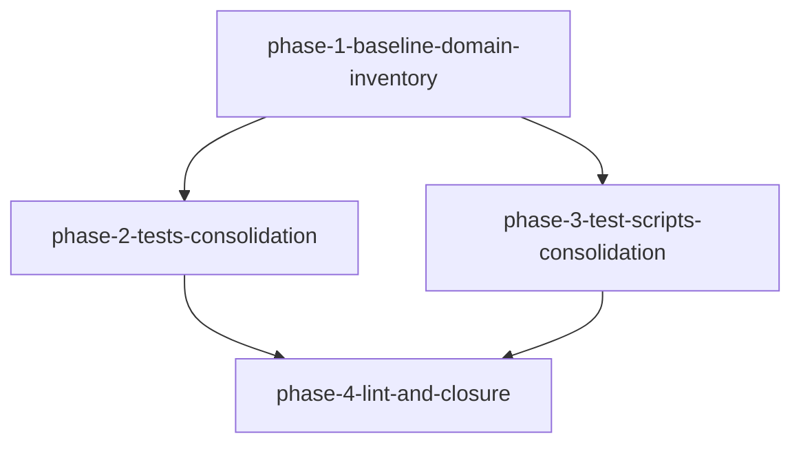

# Solution Design — vscode-dsh 测试资产整合（能力域活文件）

> 工作流 slug：`vscode-dsh-test-consolidation`。本设计仅重组测试资产，**不新增产品行为**、**不新增门禁脚本**。
> `ui_relevant: false`：不经过 HG-1.5、不调用 ui-ux-pro-max、不产 design-system、不设视觉基准。

## 范围覆盖

本设计覆盖 `phase-plan.md` 中定义的全部 4 个 Phase（phase-1 基线冻结 → phase-2 tests 归并 / phase-3 test-scripts 去重 → phase-4 lint 收口）。
写面仅限 `apps/vscode-dsh/tests/**`、`apps/vscode-dsh/test-scripts/**` 与 `.specdev/specs/vscode-dsh-test-consolidation/tech-debt-registry.md`。
`apps/vscode-dsh/src/**`、`apps/vscode-dsh/webview/**`、`packages/**`、`scripts/**`、`.oxlintrc*.json`、`constitution.md` 一律不动（AC-24 / AC-5）。

## 现状依据

| 事实（本设计依赖的现状） | 证据 |
|------|------|
| 仓库无 `main`，集成分支是 `new/vscode-dsh`（Phase 分支必须改用该分支，不 `git checkout main`） | `.specdev/specs/vscode-dsh-test-consolidation/requirements.md:162` |
| Node 权威解释器要求 `^22.19.0 \|\| >=24.0.0`（本机默认 node 被 `~/.bashrc` 第 151 行写死为 v20.16.0，属环境陷阱、不作基线） | `package.json:9` |
| `tests/tsconfig.json` 头部注释声明「目录过大不可作为 program」，是刻意用逐文件白名单的私有 lint 契约 | `apps/vscode-dsh/tests/tsconfig.json:8` |
| 该 tsconfig 记录：12 白名单文件 `tsc --noEmit` = 171 error，全目录 probe = 460 error | `apps/vscode-dsh/tests/tsconfig.json:9` |
| `include` 白名单为 12 个逐文件路径，非 glob（AC-15 要改成 glob） | `apps/vscode-dsh/tests/tsconfig.json:36` |
| `buildThinChatHtml` 已废弃（fixture-only，Phase 2 起不再被生产 Panel 使用） | `apps/vscode-dsh/src/chat-panel/chat-panel-provider.ts:7` |
| `buildThinChatHtml` 定义仍在（layer-A 系列 spec 仍 import 它） | `apps/vscode-dsh/src/chat-panel/chat-panel-provider.ts:190` |
| SPA HTML 的替代实现是 `buildEditorChatSpaHtml`（AC-24 允许测试资产改引用它） | `apps/vscode-dsh/src/chat-panel/editor-chat-panel.ts:116` |
| 全仓 lint 入口是 `lint:contracts-ready` = `tsx scripts/run-oxlint.ts .`（tests 目录当前无独立 lint gate） | `package.json:32` |
| shell 语法门禁 `check:test-scripts-syntax` 挂在根脚本，pin 3 个 shell 资产 + glob 发现 `.sh` | `package.json:67` |
| 该门禁实现 `bash -n` 校验，pin 3 资产为 smoke/shadow-preset/chat-ready | `scripts/check-test-scripts-syntax.sh:24` |
| `DEBT-1` 镜像原语：`layer-v-driver/extension.cjs` 侧 `captureScreenshot` 为 2 参（用模块级 `ARTIFACT_DIR`） | `apps/vscode-dsh/test-scripts/layer-v-driver/extension.cjs:809` |
| `DEBT-1` 镜像原语：`capability-runner.cjs` 侧 `captureScreenshot` 为 3 参（显式传 `artifactDir`） | `apps/vscode-dsh/test-scripts/layer-v-capability-driver/capability-runner.cjs:563` |
| `DEBT-1` 镜像常量 `OVERSIZED_CAPTURE_AREA` 双侧各一份（值均为 `'4096x2160'`） | `apps/vscode-dsh/test-scripts/layer-v-driver/extension.cjs:59` / `apps/vscode-dsh/test-scripts/layer-v-capability-driver/capability-runner.cjs:57` |
| `DEBT-1` 镜像类 `StageError` 双侧各一份 | `apps/vscode-dsh/test-scripts/layer-v-driver/extension.cjs:97` / `apps/vscode-dsh/test-scripts/layer-v-capability-driver/capability-runner.cjs:69` |
| 能力清单 manifest 以 `group` 组织（首个 capability 的 `group` 为 `react-spa-main`），共 12 个 group | `apps/vscode-dsh/test-scripts/layer-v-capabilities.json:8` |
| verifier 独立性在宪法中为流程义务表述（§4.3），本工作流不得修改宪法 | `.specdev/specs/vscode-dsh-test-consolidation/constitution.md:44` |
| `check:test-scripts-syntax` 由 `ciSharedStaticGates()` 挂载，属既有 gate 图（本工作流不新增 gate，只让已有 gate 对 tests/test-scripts 通过） | `scripts/run-gates.ts:312` |

> 补充事实（跨文件证据见工作流级调研报告 `.specdev/specs/vscode-dsh-test-consolidation/repo-exploration.md`）：
> - tests 目录 61 个 spec（`.spec.ts` + `.spec.tsx`）按 SUT 自然聚类 10 类（repo-exploration §3.1）。
> - `src/` 边界：25 顶层模块 + 6 子目录（`change/`、`chat-panel/`（含 `render/`）、`code-context/`、`fork/`、`markdown/`、`search/`）。
> - DEBT-1 真实镜像原语集合 = 19 项（18 函数/类 + 1 常量），远大于需求 AC-20 的 9 项基线（repo-exploration §9）。
> - oxlint 基线「1184→203」**未独立复测**（repo-exploration §7 R-4 ❓ UNKNOWN），见下文 §oxlint 基线说明。

---

## 架构摘要

把 `apps/vscode-dsh/tests/` 的 61 个按 Phase/feature/spike/verifier 碎片化命名的 spec 文件，重组为 10 个按**能力域**命名的活文件 `cap-<domain>.spec.ts|tsx`；每个保留用例携带全局唯一 `CAP-<DOMAIN>-<NNN>` 编号，全部 keep/drop 决策落到唯一台账 `assertion-map.md`。能力域清单 `capability-domains.json` 同时吸收 tests 与 test-scripts 的归属关系，并声明每个域的 `entryAssertions`（可判定入口覆盖）。`test-scripts/` 抽取 `layer-v-support/` 共享原语消除 `DEBT-1` 的 19 项镜像双拷贝。`tests/tsconfig.json` 的 `include` 改 glob 使全目录进入 lint program，203 条真实 lint 缺陷在测试资产内修掉，最终在 Node 24.3.0 下 `vitest run apps/vscode-dsh/tests` 全绿。

## 关键架构决策

### 决策 1：能力域定稿为 10 个（非需求假设的「9 个左右」）

**选择**：定稿 10 个能力域：`session-host`、`conversation`、`timeline`、`interaction`、`code-context`、`change-list`、`search`、`chat-panel`、`webview`、`test-harness`。

**理由**：
1. 61 个 spec 的 SUT 自然聚类恰好 10 类（repo-exploration §3.1 A–J），本域清单与之一一对应，保证「每个整合前文件恰好归属一个域、不遗漏不重复」（AC-2）。
2. 每个域对应一组边界清晰的 `src/` 模块（见下文域清单 §src 对应），是「一个可独立选取的回归面」（S-5：`vitest run cap-<domain>.spec.ts` 即得该域完整回归面），而非「产品模块的镜像」。
3. manifest 的 12 个 `group` 可**多对一**映射到这 10 域（AC-19 明确允许多对一），无需为迁就 group 数造 12 域。

**被否决的替代方案**：
- **9 域**（照抄需求假设）——没有对应的 SUT 聚类边界，会把 `change-list` 并入 `conversation` 或把 `webview` 并入 `chat-panel`，破坏「.tsx(jsdom) 与 .ts(node) 分文件」的硬约束（R-4/R-7）。
- **12 域**（镜像 manifest 12 group）——会把「react-spa-main vs editor-panel」「history vs continue vs fork」等 group 升格为独立测试文件，但单元测试层面这些 group 的 spec 相互纠缠（如 `phase4-subagent-enter-pin` 横跨 conversation/chat-panel/interaction），强行拆分会造成大量「一个文件横跨多域」的归类纠纷。

### 决策 2：命名与编号 —— `cap-<domain>` + `CAP-<DOMAIN>-<NNN>`

**选择**：
- 域文件名：`cap-<domain>.spec.ts|tsx`（`<domain>` 小写连字符）；`.tsx` 域（webview）用 `.spec.tsx`，其余用 `.spec.ts`。
- 顶层 `describe` 标题：`describe('cap:<domain> — …')`（AC-3）。
- 断言编号：`CAP-<DOMAIN>-<NNN>`，`<DOMAIN>` 为域 id 大写连字符，`<NNN>` 三位十进制 `001`–`999`（同域不要求连续）。
- 旧 `AC-<n>`（工作流需求文档编号）不得出现在测试资产的 `it`/`test` 标题或代码注释中；标题/注释按功能语义描述。

**理由**：编号即定位（R-2 报错行即编号）；台账 + git 历史承担「原文件 → 新编号」反查（S-4）。

**被否决的替代方案**：沿用 `AC-<n>` —— 跨工作流撞号（问题陈述已点名）；域段缺失无法 `grep -rl 'cap:change-list'` 定位。

### 决策 3：台账 `assertion-map.md` 是唯一追溯载体

**选择**：唯一 keep/drop 台账为 `apps/vscode-dsh/tests/assertion-map.md`（markdown 表），逐条记录整合前每个用例声明。不建 `.archive/`、不复制旧 spec（AC-25）。

**理由**：唯一真相源避免「台账与第二份副本漂移」；git 历史已保留整合前内容，无需额外副本。

**被否决的替代方案**：用 JSON 台账 —— 可机读但不可人读，reviewer 逐条复核（AC-12/27/29）成本高；markdown 表便于 diff 审阅。

### 决策 4：DEBT-1 去重 —— 抽 `layer-v-support/` 共享 CJS 原语模块，统一 `captureScreenshot` 签名为 3 参

**选择**：
- 真实镜像原语集合 = **19 项**（18 函数/类 + 1 常量，见 §DEBT-1 去重方案），全部抽到 `apps/vscode-dsh/test-scripts/layer-v-support/primitives.cjs`（单一 CJS 模块），两个 driver `require` 复用，定义处数各为 1。
- `captureScreenshot` 签名漂移（2 参 vs 3 参）**统一为 3 参** `captureScreenshot(capture, fileName, artifactDir)`；`layer-v-driver/extension.cjs` 侧调用时显式传入其模块级 `ARTIFACT_DIR`。

**理由**：消除「单侧修 bug 时语义漂移」的根源（DEBT-1 原文）；3 参显式传目录比 2 参隐式模块级常量更可测、更通用。AC-23 保证整合后退出码不变，故签名统一不改可执行结论。

**被否决的替代方案**：
- **统一为 2 参**（runner 侧去参数改用模块级常量）——runner 是纯编排无宿主上下文，`artifactDir` 来自 `plan.artifactDir` 动态值，无法降级为常量，2 参会破坏 runner 的多 plan 场景。
- **保留两侧签名差异、只抽「完全一致」的原语**——`captureScreenshot` 是 19 项里最核心的原语，留下它不抽等于 DEBT-1 未真正关闭。

### 决策 5：lint 归零 —— tsconfig 改 glob + 203 条缺陷在测试资产内分类修复

**选择**：`tests/tsconfig.json` 的 `include` 改为 glob（如 `["**/*.spec.ts", "**/*.spec.tsx", "**/*.ts"]` 或等价可扩展形式），使全目录进入 program；203 条真实 lint 缺陷（非「无 program」型）在测试资产内修掉，不触碰生产代码。

**理由**：AC-16 基线「仅换 glob → 203 error」说明 203 条是可修的真实缺陷；「无 program」型由 glob 覆盖解决。tsc 类型错误**不**是验收条件（AC-18 明确），只记录口径。

**被否决的替代方案**：保留逐文件白名单并逐文件补充 `no-unsafe-*` 豁免 —— 违背 AC-15「必须不再用逐文件白名单」；且逐文件豁免不可扩展（AC-15 要求新 spec 自动进入 program）。

### 决策 6：Phase 拆分 4 个（DAG：1 → 2、1 → 3、2+3 → 4）

**选择**：`phase-1-baseline-domain-inventory`（基线冻结）→ `phase-2-tests-consolidation`（tests 归并）∥ `phase-3-test-scripts-consolidation`（scripts 去重）→ `phase-4-lint-and-closure`（lint 收口）。

**理由**：Phase 1 冻结的基线（文件集/用例声明集/脚本退出码/oxlint 基线）是 AC-2/AC-9/AC-23/AC-16 全部双向差集判定的前提；Phase 2（`.spec.ts` 写面）与 Phase 3（`.sh`/`.cjs` 写面）不重叠，可并行；Phase 4 的 lint 归零与 AC-14 全绿依赖 tests 与 scripts 都定稿。

**被否决的替代方案**：把 Phase 2 与 Phase 3 合并 —— 写面虽不重叠但职责差异大（断言归并 vs CJS 去重），合并会让 reviewer 的独立上下文过大；把 Phase 4 的 registry 更新（AC-21）提前到 Phase 3 —— AC-21 的「已解决表含 DEBT-1 且验证命令可复算」必须等 AC-20 去重完成，提前会留下半完成条目。

### 决策 7：verifier 独立性 = 流程义务，不建测试树结构

**选择**：不建 `.verifier-baseline.json`，域文件不含 `describe('verifier: ')` 块，不修改 `constitution.md`；verifier 独立推导场景写入 `<spec_dir>/phases/<phase>/verification.md`（含解释器版本与路径，AC-4/AC-14）。

**理由**：AC-4/AC-5 明确「承接载体是流程层，不是测试树结构」；宪法 §4.3 已是流程义务表述，无需也不得修改。

**被否决的替代方案**：在测试树内建 verifier 专属结构 —— 直接违反 AC-5(a)。

---

## 能力域定稿清单

> 域 id（小写连字符）用于文件名 `cap-<domain>.spec.ts` 与 `describe('cap:<domain> — ')`；大写连字符形式用于 `CAP-<DOMAIN>-<NNN>` 编号。

| 域 id | 大写（编号段） | 吸收的整合前 spec 文件（`absorbed`） | src/ 模块边界 | manifest group（多对一映射） |
|------|------|------|------|------|
| `session-host` | `SESSION-HOST` | `session-host.spec.ts`、`session-host-preflight.spec.ts`、`node-env-guard.spec.ts`、`host-diagnostics.spec.ts`、`layer-v-inject-disconnect.spec.ts`、`auto-start-orchestrator.spec.ts`、`phase1-auto-start.spec.ts`、`phase2-auto-ready.spec.ts`、`verifier-phase1/layer-b-lifecycle.spec.ts`、`verifier-phase2/layer-b-host.spec.ts` | `session-host.ts`、`auto-start-orchestrator.ts`、`auto-ready-coordinator.ts`、`host-diagnostics.ts`、`node-env-guard.ts`、`connection-ui.ts`、`env.ts`、`redact.ts`、`extension.ts`、`extension-index.ts` | `session-main-path` |
| `conversation` | `CONVERSATION` | `conversation-registry.spec.ts`、`multi-tab-session.integration.spec.ts`、`multi-tab-dispose.e2e.spec.ts`、`panel-close-delete.e2e.spec.ts`、`message-store-index.spec.ts`、`panel-l2-l3-protocol.spec.ts`、`editor-chat-panel.lifecycle.spec.ts`、`phase2-multitab-history-replay.spec.ts`、`phase4-subagent-enter-pin.spec.ts`、`phase4-new-conversation-chrome.spec.ts`、`gap-003-004-debt-fix.spec.ts` | `conversation-controller.ts`、`conversation-registry.ts`、`conversation-tab-bar.ts`、`conversation-titles.ts`、`message-store.ts`、`replay-hydrator.ts` | `editor-panel`、`subagent` |
| `timeline` | `TIMELINE` | `timeline-projector.spec.ts`、`timeline-diff.e2e.spec.ts`、`timeline-diff.integration.spec.ts`、`spike-attribution-snapshot.spec.ts`、`phase2-history-delete-host.spec.ts`、`phase3-restart-continue.spec.ts`、`phase3-review-revert-replay.spec.ts`、`chat-ux-fork-retry-branch.spec.ts` | `timeline-store.ts`、`timeline-view.ts`、`history-view.ts`、`diff-entry.ts`、`restore-planner.ts`、`continue-capability.ts`、`fork/fork-orchestrator.ts` | `history`、`continue`、`fork` |
| `interaction` | `INTERACTION` | `interaction-approval-resolution.spec.ts`、`interaction-fail-closed.e2e.spec.ts`、`interaction-fail-closed.integration.spec.ts`、`replaceability-interaction-ui.spec.ts`、`gap-005-009-debt-fix.spec.ts` | `interaction-coordinator.ts`、`interaction-ui.ts` | `interaction` |
| `code-context` | `CODE-CONTEXT` | `phase1-code-context.spec.ts` | `code-context/{at-path,open-reference,ref-read-coverage,selection-ask,selection-meta,index}.ts` | `code-context` |
| `change-list` | `CHANGE-LIST` | `phase2-change-list-display.spec.ts`、`chat-ux-refs-changes-diff.spec.ts`、`layer-a/refs-changes-diff.spec.ts` | `change/{change-attributor,change-ignore,change-index,change-store,index,revert,snapshot-store,types}.ts` | `change-list` |
| `search` | `SEARCH` | `chat-ux-session-search.spec.ts` | `search/{session-search,path-session-index,index}.ts` | `search` |
| `chat-panel` | `CHAT-PANEL` | `chat-ux-activity-stream.spec.ts`、`chat-ux-streaming-cancel-follow.spec.ts`、`phase3-chat-ui-chassis.spec.ts`、`phase5-should-polish.spec.ts`、`layer-a/activity-stream.spec.ts`、`layer-a/streaming-cancel-follow.spec.ts`、`layer-a/foundation-render-probe.spec.ts`、`layer-a/protocol-decision-smoke.spec.ts` | `chat-panel/*`（`chat-panel-host`、`chat-panel-provider`、`editor-chat-panel`、`protocol`、`probes`、`activity-types`、`index`）＋ `chat-panel/render/*`、`markdown/safe-markdown.ts` | （UI 底盘，manifest 无独立 group，经 `editor-panel` 归 conversation 侧；此处为单元/集成写面） |
| `webview` | `WEBVIEW` | `layer-a-rtl/editor-chat-shell.spec.tsx`、`layer-a-rtl/editor-chat-phase2.spec.tsx`、`verifier-phase1/layer-a-rtl.spec.tsx`、`verifier-phase2/layer-a-rtl.spec.tsx` | `webview/src/{App,bridge/message-bridge,store/chat-ui-store,probes}` | `react-spa-main` |
| `test-harness` | `TEST-HARNESS` | `artifact-index.spec.ts`、`display-evidence.spec.ts`、`display-evidence-shell.spec.ts`、`build-freshness.spec.ts`、`sandbox-clean-state.spec.ts`、`chat-ready-regression.spec.ts`、`layer-v-capabilities-phase3.spec.ts`、`layer-v-capability-runner.spec.ts`、`spike-t0a-replay-rebuild.spec.ts`、`spike-t0b-continue-capability.spec.ts` | `apps/vscode-dsh/test-scripts/**`（自身 tester，SUT 是 test-scripts 资产或 `packages/**`） | `test-hooks` |

> 域数 = **10**。`absorbed` 精确文件集以 **Phase 1 冻结的 `find` 采集结果为基线**（不得用 `git ls-tree`，会漏未入库文件，AC-2）；上表为设计定稿的归类框架，Phase 1 产出 `capability-domains.json` 时按冻结基线双向差集校验为空。
> 3 个 helper（`spike-attribution-helpers.ts` → timeline；`spike-t0a-replay-hydrator.ts`、`spike-t0b-continue-helpers.ts` → test-harness）与 `fixtures/` 随主 spec 文件归入对应域，不作为独立 spec 文件（AC-1 只约束 `.spec.ts|tsx` 命名）。

### group → domain 映射表（AC-19 判定依据）

| manifest group | 域 id |
|------|------|
| `react-spa-main` | `webview` |
| `editor-panel` | `conversation` |
| `session-main-path` | `session-host` |
| `subagent` | `conversation` |
| `code-context` | `code-context` |
| `change-list` | `change-list` |
| `search` | `search` |
| `fork` | `timeline` |
| `continue` | `timeline` |
| `history` | `timeline` |
| `interaction` | `interaction` |
| `test-hooks` | `test-harness` |

12 group 全部映射，多对一；映射表落盘于 `apps/vscode-dsh/tests/capability-domains.json` 的 `groupMapping` 字段（见数据模型）。

---

## 核心实体 / 数据模型

### 1. `apps/vscode-dsh/tests/capability-domains.json`（新增，AC-2/AC-11/AC-19）

```jsonc
{
  "schemaVersion": 1,
  "groupMapping": {
    "react-spa-main": "webview",
    "editor-panel": "conversation",
    "session-main-path": "session-host",
    "subagent": "conversation",
    "code-context": "code-context",
    "change-list": "change-list",
    "search": "search",
    "fork": "timeline",
    "continue": "timeline",
    "history": "timeline",
    "interaction": "interaction",
    "test-hooks": "test-harness"
  },
  "domains": [
    {
      "id": "session-host",
      "spec": "cap-session-host.spec.ts",
      "scripts": ["run-layer-v-smoke.sh", "layer-v-driver/extension.cjs"],
      "absorbed": ["session-host.spec.ts", "session-host-preflight.spec.ts", "/* ... */"],
      "entryAssertions": [
        { "entrypoint": "dsh.test.getStartState", "caps": ["CAP-SESSION-HOST-001", "/* ... */"] }
      ],
      "verifierSources": null
    }
    // ... 其余 9 域
  ]
}
```

- `id`：域 id（小写连字符）。
- `spec`：域 spec 文件路径（相对 `apps/vscode-dsh/tests/`），或 `null`（本工作流所有域都有 spec）。
- `scripts`：⚠️ 已降级为历史字段（Phase 3 起不再作为 AC-19 归属的唯一真相源），保留仅作可读性参考。
- `testScripts`（顶层数组，Phase 3 新增）：AC-19 四类归类的唯一真相源。元素 `{ path, category, domain }`；`category` ∈ `{entry-orchestration, shared-primitives, capability-manifest-data, support-resources}`，`domain` ∈ 10 域 id 集合。
- `absorbed`：域吸收的整合前 spec 路径列表（AC-2 双向差集判定对象）。
- `entryAssertions`：非空数组，元素 `{ entrypoint, caps }`；`entrypoint` = 该域对外可观察入口（命令 id / 导出符号 / IPC 消息 / 工具名），`caps` = 非空 `CAP-` 编号数组（AC-11）。
- `verifierSources`：仅记录（可选），本工作流填 `null` 或省略。

### 2. `apps/vscode-dsh/tests/assertion-map.md`（新增，AC-9/AC-27/AC-29）

台账表（markdown），每行一个整合前用例声明（`it.each` 一行静态声明记一行）：

| 列 | 必填 | 说明 |
|---|:--:|------|
| 原文件 | 全部 | 整合前 spec 路径 |
| 原标题 | 全部 | 整合前 `it`/`test` 标题原文（`it.each` 记格式字符串） |
| 处置 | 全部 | `keep` \| `drop` |
| 理由码 | 全部 | keep 行填命中 K1/K2/K3（≥1）；drop 行填恰一 D1–D4 |
| keepChecks.K1/K2/K3 | 全部 | 三 bool |
| K 依据 | K=true 的行 | `路径:行号`（AC-27 ②，路径存在 + 行号不越界） |
| privateSymbols | 仅 D2 行 | 被断言的私有符号名（非空，可在原文件 grep 到） |
| replacementCap | 仅 D3 行 | 替代 `CAP-` 编号（存在于树中） |
| 关闭依据 | 仅 D4 行 | `verification.md` 路径 / registry id / commit sha |
| 新 CAP- 编号 | 仅 keep 行 | 整合后新编号（存在于树中） |
| weakened | 全部 | bool；整合后断言弱于来源时 `true` 并给理由（AC-29 ③） |

### 3. `apps/vscode-dsh/test-scripts/layer-v-support/primitives.cjs`（新增，AC-20）

共享 CJS 原语模块，导出 19 项镜像原语（见 §DEBT-1 去重方案）。无 npm 依赖，纯 CommonJS（保持 VS Code 可 `require` 的形状，repo-exploration §6.3）。

---

## DEBT-1 去重方案（真实镜像原语清单）

> 需求 AC-20 的 9 项基线**不完整**。code-explorer 实测真实镜像集合为 **19 项**（含 1 常量），其中 `captureScreenshot` 存在签名漂移（2 参 vs 3 参）。实现阶段以本清单为准。

| # | 原语 | `layer-v-driver/extension.cjs` | `capability-runner.cjs` | 漂移 |
|:--:|------|:--:|:--:|:--:|
| 1 | `OVERSIZED_CAPTURE_AREA`（常量） | `:59` | `:57` | 值一致 |
| 2 | `StageError`（class） | `:97` | `:69` | 需逐行比对 |
| 3 | `linkFailure` | `:111` | `:83` | 需逐行比对 |
| 4 | `harnessError` | `:112` | `:84` | 需逐行比对 |
| 5 | `skipNoCredentials` | `:114` | `:85` | 需逐行比对 |
| 6 | `sleep` | `:116` | `:87` | 需逐行比对 |
| 7 | `nowIso` | `:120` | `:91` | 需逐行比对 |
| 8 | `truncate` | `:124` | `:95` | 需逐行比对 |
| 9 | `safeJson` | `:139` | `:105` | 函数体一致 |
| 10 | `unwrap` | `:173` | `:136` | 需逐行比对 |
| 11 | `poll` | `:245` | `:151` | 需逐行比对 |
| 12 | `assistantText` | `:519` | `:256` | 需逐行比对 |
| 13 | `pngVerdict` | `:550` | `:418` | 需逐行比对 |
| 14 | `sha256Of` | `:564` | `:432` | 需逐行比对 |
| 15 | `runCapture` | `:695` | `:440` | 需逐行比对 |
| 16 | `outputFreeTemplateViolation` | `:688` | `:455` | 需逐行比对 |
| 17 | `probeScreenSize` | `:660` | `:463` | 需逐行比对 |
| 18 | `resolveCaptureTool` | `:727` | `:490` | 需逐行比对 |
| 19 | `captureScreenshot` | `:809` | `:563` | 🔴 签名漂移：2 参 vs 3 参 |

- **单侧原语（不属镜像，不计入 AC-20 去重判定）**：`pollForStream` 仅存在于 `capability-runner.cjs:187`（流式增量），本就 1 处定义，可随 `layer-v-support` 抽取但非强制。
- **去重目标**：上表 19 项每项在 `test-scripts/**` 内定义处数 = 1（AC-20 判定 `grep -rnE "(function|const)\s+<name>\b"` 计数 = 1）。
- **签名统一**：`captureScreenshot(capture, fileName, artifactDir)`（3 参）。`extension.cjs` 调用点改为传其模块级 `ARTIFACT_DIR`；`capability-runner.cjs` 原样传 `plan.artifactDir`。
- **落地位置**：`apps/vscode-dsh/test-scripts/layer-v-support/primitives.cjs`，两个 driver `require('./../layer-v-support/primitives.cjs')`（`extension.cjs` 与 `capability-runner.cjs` 分处 `layer-v-driver/`、`layer-v-capability-driver/`，相对路径由 implementer 定，保证 `require` 解析正确）。
- **不破坏 AC-23**：抽取是纯搬移（不改函数体语义），`run-layer-v-smoke.sh` / `run-layer-v-capabilities.sh` 的退出码必须与整合前一致（基线由 Phase 1 采集）。

---

## 命名与编号方案

- 文件：`cap-<domain>.spec.ts|tsx`；`.tsx`(jsdom webview RTL) 域 `webview` 用 `.spec.tsx`，其余 9 域用 `.spec.ts`。
- 顶层 `describe`：`describe('cap:<domain> — <中文/英文域描述>', () => …)`；标题首段 `cap:<domain>` 与域 id 一致（AC-3 判定 `grep -c "^describe('cap:<domain> — "` ≥ 1）。
- 断言编号：`CAP-<DOMAIN>-<NNN>`；`<DOMAIN>` 大写连字符（见表），`<NNN>` 三位十进制 `001`–`999`，同域不要求连续，全树唯一（AC-6/AC-7/AC-8）。
- 旧 `AC-<n>` 迁移：从测试资产的标题/注释中移除（工作流编号不进入测试资产），标题/注释按功能语义描述（AC-10）。
- 动态标题（R-5）：含模板拼接的动态 `it.each` 标题必须改为字面量，保证 `CAP-` 编号稳定计数。

---

## 筛选执行方案（K1–K3 / D1–D4 逐条判定）

判定单元 = 整合前每个用例声明行（`it`/`test`/`it.each` 一行记一行）。对每个判定单元：

```
1. 计算 keepChecks：K1（外部可观察行为）、K2（跨模块集成 ≥2 模块）、K3（负向对照）
   每个为 true 的 K 必须给「可判定依据」`路径:行号`（AC-27 ②）
2. 三 K 都不命中 → 判 D1/D2，必须恰命中一个：
   - D1 一次性探查：给「结论已固化」依据（`路径:行号` 或受影响用例编号）
   - D2 实现细节耦合：给被断言的私有符号名（非空，可在原文件 grep 到）
   → 处置 = drop，理由码 = 该 D
3. 任一 K 命中 → 候选 keep，但必须先做 D3/D4 独立复查（D3/D4 不受「命中 K」豁免）：
   - D3 已被更严用例覆盖：给替代 CAP 编号（存在于树中）
   - D4 债修复临时守卫：给缺陷关闭依据（verification.md / registry id / commit sha）
   → 命中即 drop，理由码 = 该 D；均不命中才 keep，理由码 = 命中 K 集合，新编号 = CAP-<DOMAIN>-<NNN>
4. 既无 K 也无 D → 不得静默，升级交 reviewer-correctness / 调度者裁决
```

硬约束（AC-27/AC-28/AC-29）：
- 禁止以 D1/D2 删除 K1–K3 命中项（AC-27 ①）。
- D3/D4 可删除 K 命中项（重复覆盖 / 过期守卫不因命中 K1 而豁免）；D3/D4 drop 行 `keepChecks` 可为 true。
- drop 行理由码恰一 D（AC-28）；keep 行理由码 ≥1 K。
- 整合后断言弱于来源用例 → 台账标 `weakened: true` + 理由，且不得计入 `entryAssertions.caps`（AC-29 ③）。
- spike/gap 5 文件（`gap-003-004`、`gap-005-009`、`spike-attribution-snapshot`、`spike-t0a-replay-rebuild`、`spike-t0b-continue-capability`）每条断言必须落台账有明确处置（AC-26）。

## lint 归零方案（AC-15–18）

1. **tsconfig glob 化**：`apps/vscode-dsh/tests/tsconfig.json` 的 `include` 改为 glob（如 `["**/*.ts", "**/*.tsx"]`），覆盖全目录，删除逐文件白名单（AC-15）。
2. **头部注释更新**：删除「目录过大不可作为 program」与逐文件白名单理由，改为说明新 glob 口径（AC-17）。
3. **203 条缺陷分类修复**（AC-16）：以 `npx tsx scripts/run-oxlint.ts apps/vscode-dsh/tests` 输出为清单，逐条在**测试资产内**修：类型感知 `no-unsafe-*`（给断言对象显式类型 / 收窄）、非类型类规则（风格/正确性）直接修。**不得**为修 lint 改 `src/**`（AC-24）；若某条必须改生产代码 → HG-2/HG-3 显式升级。
4. **`buildThinChatHtml` 废弃引用**：`layer-a/foundation-render-probe.spec.ts`、`layer-a/refs-changes-diff.spec.ts`、`phase1-code-context.spec.ts`、`phase3-restart-continue.spec.ts`、`phase3-review-revert-replay.spec.ts`、`phase5-should-polish.spec.ts` 等仍调用已废弃 `buildThinChatHtml` 的 spec，改为引用 `buildEditorChatSpaHtml` 或移除该 fixture 路径（AC-24 补充条款允许，属测试资产变更）。
5. **tsc 类型错误口径**（AC-18）：临时 program 下 `tsc --noEmit` 仍有类型错误，且该 program 无 `references`、不参与 `pnpm run typecheck`。tsc 归零**不是**本工作流验收条件，但「未归零」必须显式记录在 registry（见 AC-18），标注后续归属（`DEBT-019` tests 段口径）。
6. **oxlint 基线引用口径**（R-4）：需求 AC-16 的「1184→203」**未独立复测**。Phase 1 基线冻结时复测留档：`npx tsx scripts/run-oxlint.ts apps/vscode-dsh/tests`（现状配置）与 glob 化后（改 include 不动文件）各记一次真实 error 数；design/registry 引用时标注「Phase 1 复测值」，不把 203 当已确认实测值。

---

## Phase DAG 依赖



- phase-2 与 phase-3 写面不重叠（`.spec.ts` vs `.sh/.cjs`），Phase 1 完成后可并行。
- phase-4 依赖 phase-2（tests 归并后 lint 才有意义）与 phase-3（DEBT-1 关闭 + registry 更新）双双定稿。

## 外部依赖

无新增 npm 依赖、无新基础设施。仅复用既有 `vitest`、`oxlint`、`tsx`、`bash`；运行环境为唯一权威解释器 Node 24.3.0（`env PATH="/usr/local/n/versions/node/24.3.0/bin:$PATH" <cmd>`）。

## 高风险子系统

1. **合并后 hook/fixture 作用域污染**（R-1/R-5）：按域保留独立顶层 `describe`，不拍平 `beforeEach`/`vi.mock`；Phase 1 产出「每文件 hook/fixture 依赖清单」作为归并前置。
2. **`.tsx`(jsdom) 与 `.ts`(node) 同文件可行性**（R-4/R-7）：`webview` 域拆独立 `.spec.tsx`，不与其他 `.ts` 域混文件。
3. **203 条 lint 修复触发断言语义变更**（R-3）：逐条分类，语义变更记入 `implementation.md` 偏差章节 + AC-29 ③ 台账 `weakened`。
4. **DEBT-1 抽取破坏 AC-23**：抽取后 `run-layer-v-smoke.sh` / `run-layer-v-capabilities.sh` 退出码必须与 Phase 1 基线一致，不一致即 MUST-FIX。

## 权衡/替代方案

见「关键架构决策」各条「被否决的替代方案」。汇总：
- 域数 10 vs 9 vs 12 → 10（对齐 SUT 聚类 + `.tsx/.ts` 分文件约束）。
- 编号 `CAP-<DOMAIN>-<NNN>` vs 沿用 `AC-<n>` → `CAP-`（域定位 + 全局唯一）。
- 台账 markdown vs JSON → markdown（人可读、diff 友好）。
- 去重 3 参 vs 2 参 vs 保留漂移 → 3 参（可测 + 真正关闭 DEBT-1）。
- lint glob vs 逐文件白名单 → glob（可扩展，AC-15 硬要求）。

## 验收标准验证方案

| ID | 类型 | 场景 | 预期结果 | 优先级 |
|----|------|------|---------|:------:|
| VP-1 | 静态检查 | `find apps/vscode-dsh/tests -type f \( -name '*.spec.ts' -o -name '*.spec.tsx' \) \| grep -E 'phase[0-9]\|gap-[0-9]\|spike-\|verifier-phase'` | 输出为空（AC-1） | must |
| VP-2 | 静态检查 | capability-domains.json 全部 `absorbed` 并集 vs Phase 1 冻结文件集双向差集 | 为空（AC-2） | must |
| VP-3 | 静态检查 | `grep -rhoE 'CAP-[A-Z0-9-]+-[0-9]{3}' … \| sort \| uniq -d` | 为空（AC-7） | must |
| VP-4 | 静态检查 | 台账行并集 vs Phase 1 冻结用例声明集双向差集 | 为空（AC-9） | must |
| VP-5 | 运行时验证 | `env PATH="/usr/local/n/versions/node/24.3.0/bin:$PATH" ./node_modules/.bin/vitest run apps/vscode-dsh/tests` | `failed` = 0（AC-14） | must |
| VP-6 | 运行时验证 | `pnpm run check:test-scripts-syntax` | 退出码 0（AC-22） | must |
| VP-7 | 运行时验证 | `npx tsx scripts/run-oxlint.ts apps/vscode-dsh/tests` | 退出码 0，0 error（AC-16） | must |
| VP-8 | 静态检查 | `grep -rnE "(function\|const)\s+captureScreenshot\b" apps/vscode-dsh/test-scripts` 及 19 项逐项计数 | 每项 = 1（AC-20） | must |
| VP-9 | 运行时验证 | 无凭证环境 `run-layer-v-smoke.sh` / `run-layer-v-capabilities.sh` 退出码 vs Phase 1 基线 | 逐脚本一致（AC-23） | must |
| VP-10 | 静态检查 | `git diff --name-only <base>..HEAD \| grep -E '^(apps/vscode-dsh/(src\|webview)\|packages)/'` | 为空（AC-24） | must |

> 本工作流 `ui: false`，无 visual 验证项。

## 设计修订记录

| # | 日期 | 原设计章节 | 修改为 | 批准人 | 偏差来源 |
|---|------|-----------|--------|--------|---------|
| R-1 | 2026-09-19 | 核心实体/数据模型 §1 | 新增顶层 `testScripts` 字段（`{ path, category, domain }`）承载 AC-19 四类归类；`domains[].scripts` 降级为历史字段，不再作 AC-19 唯一真相源 | 用户确认（HG-3 SHOULD-FIX S-1） | review-design.md S-1 |
| R-2 | 2026-09-19 | DEBT-1 去重方案 | 3 处语义漂移（`assistantText` / `probeScreenSize` / `resolveCaptureTool`）选 **runner 侧**为真身：`assistantText` 采用无分隔符 `+= ''` 拼接（放弃 driver 侧 `.join('\n')`），两个临时文件名采用 `layer-v-cap-*` 前缀。理由：capabilities exit 0 是唯一真机验证通过的路径，以 runner 侧为真身 | 用户确认（HG-3 SHOULD-FIX S-2） | review-design.md S-2 |

## 建议的下一步

进入 `phase-1-baseline-domain-inventory` 的实现阶段（HG-2 确认后）。
