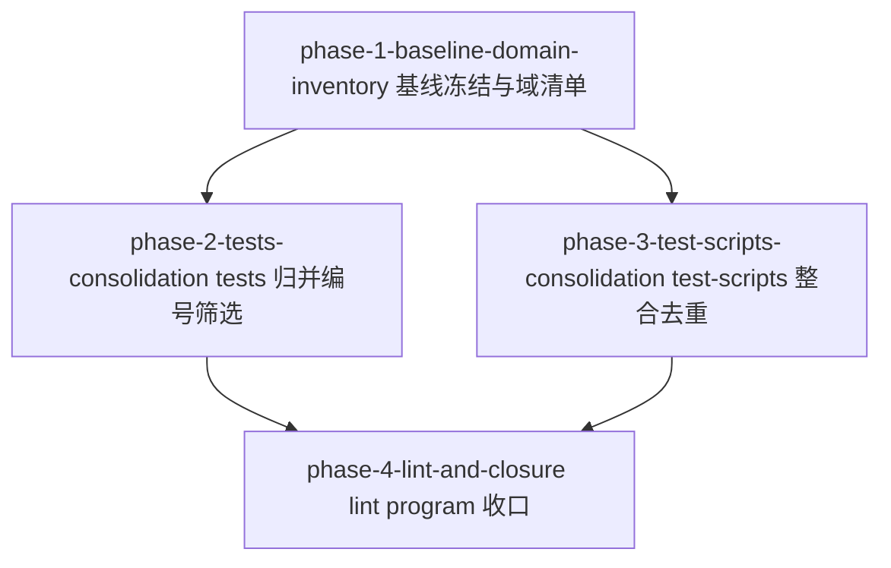

# Phase 拆分计划 — vscode-dsh 测试资产整合

## 总体策略

本工作流本质是「纯测试资产重组 + 基于内容的用例筛选」，唯一权威解释器 Node 24.3.0，集成分支 `new/vscode-dsh`（非 `main`）。拆分遵循三条原则：

1. **基线先行**：AC-2/AC-9/AC-23/AC-16 全部是「双向差集 / 退出码比对」判定，判定对象都是「整合前基线」。没有冻结基线就没有可判定的验收，故 Phase 1 先冻结基线并产出能力域清单。
2. **写面隔离并行**：tests 归并（`.spec.ts` 写面）与 test-scripts 去重（`.sh/.cjs` 写面）互不重叠，Phase 1 完成后可并行。
3. **lint 收口最后**：oxlint 归零依赖 tests 归并定稿（文件集确定）与 scripts 定稿（DEBT-1 关闭 + registry 更新），Node 全绿是所有改动完成后的最终验收。

## Phase DAG



## Phase 列表

| Phase | 名称 | 范围 | 依赖 | 验收标准数 |
|-------|------|------|------|:--------:|
| Phase 1 | 基线冻结与能力域清单 | 冻结整合前基线（文件集/用例声明集/脚本退出码/oxlint 基线/解释器路径）+ 未入库 spec 纳入版本控制 + 产出 `capability-domains.json` 骨架与 `assertion-map.md` 台账骨架 | 无 | 4（含 3 条基线采集 + AC-2） |
| Phase 2 | tests 归并、编号与筛选 | 61 spec 归并为 10 域文件、建立 `CAP-` 编号、逐行落台账（keep/drop + 理由码）、处理 spike/gap 文件、填 `entryAssertions` | Phase 1 | 16 |
| Phase 3 | test-scripts 整合与去重 | `test-scripts/` 四类分层、抽 `layer-v-support/primitives.cjs` 共享原语消除 DEBT-1、更新 registry | Phase 1 | 5 |
| Phase 4 | lint program 与收口 | `tsconfig.json` 改 glob、tests oxlint 归零、tsc 口径记录、Node 24.3.0 全绿收口 | Phase 2, Phase 3 | 6 |

## DAG 任务编排（JSON）

```json
{
  "phases": [
    {
      "id": "phase-1-baseline-domain-inventory",
      "name": "基线冻结与能力域清单",
      "ui": false,
      "dependencies": [],
      "scope": "冻结整合前基线（文件集/用例声明集/脚本退出码/oxlint 基线/Node 解释器路径），把未入库 spec 纳入版本控制，产出 capability-domains.json 骨架与 assertion-map.md 台账骨架",
      "acceptance_criteria": ["AC-2", "AC-16(基线复测留档)", "AC-23(基线采集留档)", "AC-14(基线确认留档)"]
    },
    {
      "id": "phase-2-tests-consolidation",
      "name": "tests 归并、编号与筛选",
      "ui": false,
      "dependencies": ["phase-1-baseline-domain-inventory"],
      "scope": "61 spec 按 10 能力域归并为 cap-<domain>.spec.ts|tsx，建立 CAP-<DOMAIN>-<NNN> 编号，逐行落 assertion-map.md（keep/drop + 理由码），处理 spike/gap 文件，回填 entryAssertions.caps",
      "acceptance_criteria": ["AC-1", "AC-3", "AC-6", "AC-7", "AC-8", "AC-9", "AC-10", "AC-11", "AC-12", "AC-13", "AC-24", "AC-25", "AC-26", "AC-27", "AC-28", "AC-29"]
    },
    {
      "id": "phase-3-test-scripts-consolidation",
      "name": "test-scripts 整合与去重",
      "ui": false,
      "dependencies": ["phase-1-baseline-domain-inventory"],
      "scope": "test-scripts 四类分层（入口编排/共享原语/能力清单数据/支撑资源），抽 layer-v-support/primitives.cjs 共享 19 项镜像原语消除 DEBT-1，更新本工作流 registry（DEBT-1 已解决、DEBT-4/5 不关闭）",
      "acceptance_criteria": ["AC-19", "AC-20", "AC-21", "AC-22", "AC-23"]
    },
    {
      "id": "phase-4-lint-and-closure",
      "name": "lint program 与收口",
      "ui": false,
      "dependencies": ["phase-2-tests-consolidation", "phase-3-test-scripts-consolidation"],
      "scope": "tests/tsconfig.json 改 glob 覆盖全目录，203 条 lint 缺陷在测试资产内修复使 oxlint 归零，tsc 类型错误口径显式记录，Node 24.3.0 下 vitest 全绿最终收口",
      "acceptance_criteria": ["AC-13", "AC-14", "AC-15", "AC-16", "AC-17", "AC-18"]
    }
  ]
}
```

> AC-4 / AC-5（verifier 独立性流程义务）**不分配**到单一 Phase —— 它们是跨 Phase 流程义务，由每个 Phase 的 verifier 在 `verification.md` 履行（独立推导场景 + 解释器版本路径），不写入测试树结构。

## 每个 Phase 的详细说明

### Phase 1: 基线冻结与能力域清单
- **目标**：用 `find` 类命令（非 `git ls-tree`）冻结整合前基线，把未入库 spec 纳入版本控制，产出能力域清单与台账骨架。
- **输入**：`design.md` 能力域定稿清单（10 域）；`repo-exploration.md` §3.1 SUT 归类。
- **产出**：
  - 冻结基线快照（文件集清单 + 用例声明集计数命令 + `run-layer-v-smoke.sh` / `run-layer-v-capabilities.sh` 退出码 + Node 24.3.0 下 `vitest run` 基线 + oxlint 现状/glob 化 error 数）写入 `implementation.md`。
  - `apps/vscode-dsh/tests/capability-domains.json`（`groupMapping` + 10 域条目：`id`/`spec`/`scripts`/`absorbed`/`entryAssertions`（entrypoint 骨架，caps 待 Phase 2 回填）/`verifierSources`）。
  - `apps/vscode-dsh/tests/assertion-map.md` 台账骨架（表头 + 全量整合前用例声明行，处置列待 Phase 2 填）。
- **验收**：AC-2（absorbed 双向差集为空）；AC-16/AC-23/AC-14 的基线采集留档可复算。

### Phase 2: tests 归并、编号与筛选
- **目标**：把 61 spec 归并为 10 个 `cap-<domain>.spec.ts|tsx`，逐用例判定 keep/drop，建立 `CAP-` 编号，回填 `entryAssertions.caps`。
- **输入**：Phase 1 的 `capability-domains.json` + `assertion-map.md` 骨架；`design.md` 筛选执行方案（K1–K3/D1–D4）。
- **产出**：10 个 `cap-<domain>.spec.ts|tsx`；完整 `assertion-map.md`；`capability-domains.json` 的 `entryAssertions.caps` 回填。
- **验收**：AC-1/3/6/7/8/9/10/11/12/13/24/25/26/27/28/29。

### Phase 3: test-scripts 整合与去重
- **目标**：`test-scripts/` 四类分层 + 抽 `layer-v-support/primitives.cjs` 消除 DEBT-1。
- **输入**：`design.md` DEBT-1 去重方案（19 项镜像原语 + 3 参签名统一）；Phase 1 脚本退出码基线。
- **产出**：`layer-v-support/primitives.cjs`；两个 driver 改为 `require` 共享模块；`test-scripts` 四类归类清单；registry 更新（DEBT-1 已解决、DEBT-4/5 不关闭）。
- **验收**：AC-19/20/21/22/23。

### Phase 4: lint program 与收口
- **目标**：tsconfig glob 化 + tests oxlint 归零 + Node 全绿收口。
- **输入**：Phase 2 定稿的 tests 文件集；Phase 3 定稿的 scripts；Phase 1 oxlint 基线。
- **产出**：`tests/tsconfig.json`（glob + 新注释）；测试资产内 lint 修复；tsc 口径记录；registry 补录（如有）。
- **验收**：AC-13/14/15/16/17/18。
