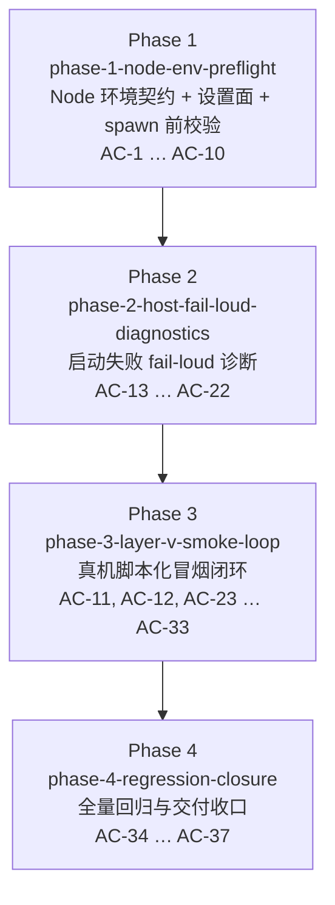

# Phase 拆分计划 — vscode-dsh 可用闭环（v7 修订稿）

| 项 | 值 |
|---|---|
| 工作流 slug | `vscode-dsh-usable-loop` |
| 需求文档 | [`requirements.md`](./requirements.md) |
| 设计文档 | [`design.md`](./design.md) / [`design-zh.md`](./design-zh.md) |
| Phase 数量 | 4（串行） |
| AC 总数 | 37（全部 `[Must]`，全部有归属，无遗漏无重复） |
| 本轮修订 | **v7**：并入用户评审 **#3 / #4 / #9** 三项（均属"如何达成"层，**不改任何 AC 的语义与归属**）。(#3) `dsh.test.getDiagnosticsText` 契约加 `schemaVersion`（记录上的字面量 `1`、不可空、恒存在、单一常量 `HOST_DIAGNOSTIC_SCHEMA_VERSION` 为唯一真相源）→ 字段 **17 → 18**，驱动按版本决定断言口径（`=== 1` / `> 1` / 缺失），**任何**字段面改动**必须** +1 版本，Phase 2 增契约完整性用例、Phase 4 契约复核行按 18 字段与版本策略重述。(#4) 影子 preset 生成逻辑独立为 `apps/vscode-dsh/test-scripts/layer-v-shadow-preset.sh`（单一实现 + `--check-shadow-preset` 薄入口；生成前断言 shipped preset **第 28–29 行**原文，不符即 fail loud；退出码 `0`/`1`/`2`，主脚本调用失败 → `HARNESS_ERROR`），**新增该路径到 `phase-3-layer-v-smoke-loop.primary_files`**。(#9) 更正文档门禁口径——`docs/development.md` 与 `apps/vscode-dsh/README.md` **不在**预算表（仅 8 条）内，属 review governs 非预算层；**Phase 1 / Phase 3 本 Phase 内**跑文档门禁快速面 **`pnpm run test:docs`**（= `tsx scripts/run-gates.ts doc-quick`，即 `run-gates` 的 `doc-quick` 聚合模式；`doc-quick` **不是** pnpm script，其唯一 pnpm 入口是 `test:docs`）并解决全部失败，**Phase 4 只复核**（`pnpm run doc-sync` 退出 0）。**Phase ID / DAG `id` / `dependencies` / `acceptance_criteria` / Phase 数量零改动** |
| 历史修订 | v6：**Xvfb 已由用户安装**（2026-09-15 实测 `/usr/bin/Xvfb` 与 `/usr/bin/xvfb-run` 存在、`dpkg-query` → `xvfb 2:1.20.13-1ubuntu1~20.04.20 install ok installed`、`DISPLAY=:1` 上 X.Org 存活）→ AD-8 收敛为 `reuse → xvfb（已安装） → SKIPPED_NO_DISPLAY`，**删除**安装分支与 `sudo -n apt-get install -y xvfb` 要求，`DEBT-003` **撤销**；同时钉死 `SKIPPED_NO_DISPLAY` / `HARNESS_ERROR` / `LINK_FAILURE` 三者映射。AD-11 **强化**为脚本**必须显式清除**继承的 `DSH_NODE_BIN`（仅"不导出"不足）。AD-12 **强化**为 step4 首步写入**未被拒绝**即**立即**判 `LINK_FAILURE`（**不等待任何超时**）并落盘模型返回内容与工具调用参数。v5：route A 已在**真机 EDH 内验证通过**（V1/V2/V3）；`toolCount` 由 26 **更正为 25**（来源 `request/header.header.tools`）；每步场景**必须**从干净沙箱状态起且 `replay` 即判 `LINK_FAILURE`；step4 拒绝目标改为 `/var/tmp/...`（不得 `$HOME`）；step5 目标文件钉死为「忽略规则由 Phase 3 交付」的探针路径（`apps/vscode-dsh/test-artifacts/layer-v/step-5-target.txt`，`git check-ignore` 命中且规则来自仓库根）；影子 preset 生成禁止空白归一化（`diff` 严格 2 行删除）；原"`HOME` 沙箱未验证"与"step4 需在 25 工具面重验"两条风险**关闭**。v4：AC-25 第 5 步定为 **route A**（`HOME` 沙箱 + 影子 preset，零仓库改动，原生 `meta.diffs`，AD-15）；`DEBT-002` 撤销、新增 `DEBT-004`（出厂 `ide` profile 主会话不可写，只登记不修） |

## 总体策略

拆分轴是**失败原因链由内向外**，不是按文件切分：

1. **最内层**（Phase 1）先保证「spawn 之前就 fail loud」。这一层的失败是 Phase 2 诊断通道要承载的第一类输入，因此必须先落地 Node 失败分类与五要素诊断文本；本轮同时落地 `dsh.nodeBin` 设置面（该 app 首次引入 settings surface）与三级解析链。
2. **中间层**（Phase 2）把 Node 门槛 / bridge listen / spawn / `initialize` 握手 / 子进程退出 / 缺凭据六类失败的诊断出口与连接区终态统一起来。Phase 1 + Phase 2 合起来消灭「UI 停在正在连接到 Host…」这个症状。
3. **最外层**（Phase 3）在真机上把可用闭环脚本化：脚本要锁定 Phase 1 的 Node 门槛（并作为 AC-10 设置来源的真机证据）、读取 Phase 2 的诊断通道内容作为断言，并在同一次真机运行中为 AC-11 的两个覆盖面分别取证，因此必须排在两者之后。
4. **收口**（Phase 4）对合并结果断言累积不回归，并完成文档、Agent Note、技术债注册表的交付收口。

### 与 requirements 的 Phase 拆分方向对比（请 HG-2 注意）

| 项 | requirements 的拆分方向 | 本计划 | 理由 |
|---|---|---|---|
| P3 范围 | AC-23 – AC-33（AC-31/32/26/33 另立 P4） | AC-11、AC-12、AC-23 – AC-33 全部放在 Phase 3 | 五步链路、逐步截图与产物索引属于**同一次真机运行**的原子交付物。若拆出「脚本骨架先交付、链路断言后交付」的中间 Phase，那个 Phase 自己的验收运行必须报出非 PASS 结论（脚本在链路未实现前不能输出通过），会直接违反 AC-27 的诚实性要求，也会让该 Phase 的 HG-3 必然落到 PARTIAL。相反，把 D 组不回归（AC-34 – AC-37）单独成 Phase 4 是成立的：它们是对**合并后**工作区整体的累积断言，且承载文档/Agent Note/债务收口。 |
| AC-10 归属 | 归入 P1（AC-1 – AC-12） | 在 Phase 1，按 `[Must]` 实现设置面 | 与拆分方向一致：AC-10 已由用户 HG-2（D-4）升为 `[Must]`，语义为「**必须** 在 `contributes.configuration` 提供 Node 可执行文件路径设置项（默认空）」，并要求优先级链写入开发者文档、无效设置 fail loud、该来源同样过 AC-4 门槛。v1 的「以条件前件为假满足 AC-10」方案已被用户明确否决，`DEBT-001` 已撤销。 |
| AC-11 归属 | 归入 P1（AC-1 – AC-12） | 在 Phase 3 | AC-11 的 `[责任侧: 本机环境]`，已按 HG-2（D-7）改写为**两个覆盖面独立判定**（终端侧 / 扩展子进程侧）。仓库侧唯一可判定的证据是冒烟脚本本次真机运行的报告（是否锁定合格 Node、两侧是否各自给出 ✅/❌），放在 Phase 3 可与 AC-12 同一次运行取证。AC-3 的**文档结构**仍在 Phase 1，作为 AC-11 判定的锚点。 |

串行而非并行：四者两两之间都存在真实依赖（Phase 2 消费 Phase 1 的 Node 失败分类；Phase 3 同时消费 Phase 1 的 Node 门槛/设置面与 Phase 2 的诊断通道；Phase 4 断言累积结果）。DAG 中没有任何一对 Phase 的依赖集为空，因此**不提出并行分支**，也不存在可并行的 Phase 对。

## Phase DAG



## Phase 列表

| Phase | ID | 名称 | 范围 | 依赖 | AC 数 |
|---|---|---|---|:--:|:--:|
| Phase 1 | `phase-1-node-env-preflight` | Node 环境契约、设置面与 spawn 前校验 | `.nvmrc`、`docs/development.md` 两张清单（本机环境侧按两覆盖面分列）、`dsh.nodeBin` 设置项、`node-env-guard`、SDK 侧单一解析源（三级来源） | 无 | 10 |
| Phase 2 | `phase-2-host-fail-loud-diagnostics` | 启动失败 fail-loud 诊断 | Output Channel、六类边界的结构化记录与分类、连接区终态与重试、凭据脱敏、`dsh.test.getDiagnosticsText`（返回**结构化 JSON 记录数组**，**18 字段契约**（含 `schemaVersion`）+ 门禁 + 契约完整性用例）、`dsh.test.listPendingInteractions` 投影扩展 | Phase 1 | 10 |
| Phase 3 | `phase-3-layer-v-smoke-loop` | 真机脚本化冒烟闭环 | 单命令脚本 + CJS 驱动扩展、五步断言（step4 两步式审批 + **首步未被拒绝即立即判失败**、**step5 按 route A 的 `HOME` 沙箱 + 影子 preset 产生原生 Diff**）、截图、显示环境 `reuse → xvfb（已安装） → SKIPPED_NO_DISPLAY`、资源回收（含 Crashpad）、产物索引、**影子 preset 生成器（`layer-v-shadow-preset.sh` + `--check-shadow-preset` 自检，可先于真机链路单独跑通）**、AC-11 两覆盖面与 AC-12 PATH 前置 + **显式清除继承 `DSH_NODE_BIN`** 取证 | Phase 2 | 13 |
| Phase 4 | `phase-4-regression-closure` | 全量回归与交付收口 | `agent-loop` 未改动、entrypoints 门禁、全量构建/vitest、既有回归脚本、Agent Note 与文档收口 | Phase 3 | 4 |

## DAG 任务编排（JSON）

```json
{
  "phases": [
    {
      "id": "phase-1-node-env-preflight",
      "ui": false,
      "name": "Node 环境契约、设置面与 spawn 前校验",
      "dependencies": [],
      "acceptance_criteria": ["AC-1", "AC-2", "AC-3", "AC-4", "AC-5", "AC-6", "AC-7", "AC-8", "AC-9", "AC-10"],
      "primary_files": [
        ".nvmrc",
        "apps/vscode-dsh/package.json",
        "apps/vscode-dsh/src/node-env-guard.ts",
        "apps/vscode-dsh/src/extension.ts",
        "apps/vscode-dsh/src/session-host.ts",
        "packages/sdk/client/src/launch.ts",
        "packages/sdk/client/src/index.ts",
        "docs/development.md"
      ]
    },
    {
      "id": "phase-2-host-fail-loud-diagnostics",
      "ui": false,
      "name": "启动失败 fail-loud 诊断",
      "dependencies": ["phase-1-node-env-preflight"],
      "acceptance_criteria": ["AC-13", "AC-14", "AC-15", "AC-16", "AC-17", "AC-18", "AC-19", "AC-20", "AC-21", "AC-22"],
      "primary_files": [
        "apps/vscode-dsh/src/host-diagnostics.ts",
        "apps/vscode-dsh/src/session-host.ts",
        "apps/vscode-dsh/src/interaction-coordinator.ts",
        "apps/vscode-dsh/src/extension.ts",
        "apps/vscode-dsh/package.json",
        "packages/sdk/client/src/client.ts"
      ]
    },
    {
      "id": "phase-3-layer-v-smoke-loop",
      "ui": false,
      "name": "真机脚本化冒烟闭环",
      "dependencies": ["phase-2-host-fail-loud-diagnostics"],
      "acceptance_criteria": ["AC-11", "AC-12", "AC-23", "AC-24", "AC-25", "AC-26", "AC-27", "AC-28", "AC-29", "AC-30", "AC-31", "AC-32", "AC-33"],
      "primary_files": [
        "apps/vscode-dsh/test-scripts/run-layer-v-smoke.sh",
        "apps/vscode-dsh/test-scripts/layer-v-shadow-preset.sh",
        "apps/vscode-dsh/test-scripts/layer-v-driver/extension.cjs",
        ".gitignore",
        "apps/vscode-dsh/README.md",
        ".specdev/specs/vscode-dsh-usable-loop/artifact-index.md"
      ]
    },
    {
      "id": "phase-4-regression-closure",
      "ui": false,
      "name": "全量回归与交付收口",
      "dependencies": ["phase-3-layer-v-smoke-loop"],
      "acceptance_criteria": ["AC-34", "AC-35", "AC-36", "AC-37"],
      "primary_files": [
        ".agents/notes/",
        "docs/wiki/VS Code IDE 集成/",
        "apps/vscode-dsh/README.md",
        "docs/development.md"
      ]
    }
  ]
}
```

> **DAG JSON 是 Phase ID 的唯一真相源。** 后续 code-explorer / implementer / reviewer / verifier 一律使用 `phases[].id` 的字符串原样命名目录（`specs/<slug>/phases/<id>/`）与 git 分支（`impl-<id>`），禁止另起名字。

## 每个 Phase 的详细说明

### Phase 1: `phase-1-node-env-preflight` — Node 环境契约、设置面与 spawn 前校验

- **目标**：让「Node 不满足要求」在 spawn 之前以五要素可操作诊断 fail loud；首次为该 app 引入 VS Code 设置面（`dsh.nodeBin`）并落实三级解析链（`DSH_NODE_BIN` > 设置 > Extension Host 自带 Node），保证设置来源与既有来源共用同一个门槛与同一个解析结果；同时保证 `DSH_NODE_BIN` / `process.execPath` 两条既有路径不回归。
- **输入**：`requirements.md` §AC-1 – §AC-10、`design.md` AD-1 / AD-2 / AD-9 / AD-10。
- **产出**：
  - `.nvmrc`（机器可读版本声明，满足根 `engines.node`）
  - `docs/development.md`(+`.zh.md`) 的 Node 环境前提清单 + 两张责任清单（AC-2 / AC-3）；本机环境侧清单**必须**按「终端侧」「扩展子进程侧」两个覆盖面分列（AC-3 明文要求，且是 AC-11 判定锚点）；文档写明 Node 来源优先级链（AC-10 明文要求）
  - `apps/vscode-dsh/package.json` 的 `contributes.configuration.dsh.nodeBin`（`string`，默认 `""`，含 description）——该 app 首次引入设置面
  - `apps/vscode-dsh/src/node-env-guard.ts` + `tests/node-env-guard.spec.ts`（AC-4 / AC-7 / AC-8 / AC-9）
  - `apps/vscode-dsh/tests/session-host-preflight.spec.ts`（门槛先于 `bridge.listen` 与 spawn 的顺序契约）
  - `packages/sdk/client/src/launch.ts` 的 `resolveNodeExecutableSpec({ nodeBinSetting })`（加性，三来源合并）+ `index.ts` re-export + `README(.zh)`（AC-5 / AC-6 / AC-10）
  - `apps/vscode-dsh/src/extension.ts` 读取 `dsh.nodeBin` 并作为显式输入传入 `HarnessClient`（AC-10）
  - `IdeSessionHost.start` 的顺序契约：`node 门槛 → bridge.listen → spawn`（AC-7）
  - 扩展 duck-typed vscode 测试替身需提供 `workspace.getConfiguration`
  - **文档门禁早期评估（v7，用户评审 #9）**：写完 `docs/development.md`(+`.zh.md`) 后**必须在本 Phase 内**跑 **`pnpm run test:docs`**（若该聚合过重，退为显式并列 `pnpm run verify-doc-budgets` + `pnpm run verify-translation-pairing` + `pnpm run verify-doc-refs`，命令**必须**与 Phase 1 spec 逐字一致）并**在本 Phase 内**解决全部失败（含重录 `.i18n.yaml`）；预算红时处置顺序固定 **Relocate → Condense → Raise**，**不得**把"上调预算"当第一手段，**不得**为迁就预算删减必需内容（AD-10 取舍）
- **验收**：`phases/phase-1-node-env-preflight/spec.md` 的逐条验证策略全部通过（含其 **「执行环境与基线快照」** 的**差量口径**，v8 修正）；`pnpm run typecheck` 0 退出；`pnpm run test packages/sdk/client` 0 退出（**不带 `--`**：带 `--` 会跑全量 1106 文件、466 失败，已实测）；`pnpm run lint`、`pnpm run test apps/vscode-dsh`、`pnpm run test:docs` 三者基线即为红，**必须零新增失败**（逐条并列改动前后失败集合并证明未新增）；`packages/sdk/client/src/launch.ts` 在覆盖率门禁下维持 per-file 100%（只能用 `test:coverage` / `test:coverage:partitioned`，**不得**用 `vitest run --coverage <path>` 过滤）。**已核实（v8）**：仓库**不存在**校验 `contributes.configuration` 的包级门禁（`verify-package-invariants` 不覆盖 `contributes`），该项只能靠运行时用例证明，**不得**按"有门禁会拦"来规划实现。
- **Phase Entry Gate**：本 Phase 无前置 Phase，无继承债务（registry 当前为空）。
- **债务动作**：`DEBT-001`（缺 settings surface）**已撤销**——该能力由本 Phase 交付。除条件性债务外，本 Phase 不登记新债务。

### Phase 2: `phase-2-host-fail-loud-diagnostics` — 启动失败 fail-loud 诊断

- **目标**：把 Host 启动的每个失败边界变成一条可检视、已脱敏、已归类的诊断记录，并让连接区在失败时显示根因终态而非进行时文案，同时不新增第二套状态权威。
- **输入**：`requirements.md` §AC-13 – §AC-22、`design.md` AD-3 / AD-4 / AD-5 / AD-14，以及 Phase 1 的 Node 失败分类。
- **产出**：
  - `apps/vscode-dsh/src/host-diagnostics.ts`（sink 端口 + 有界记录 + 脱敏）
  - `IdeSessionHost` 的六类边界记录与 `HostFailureKind` 归类 + 类型化启动错误
  - `packages/sdk/client` 的 `TransportClosedError` 结构化细节
  - Output Channel + `dsh.showHostDiagnostics` 命令 + 失败态重试记录
  - L2 hooks：**新增** `dsh.test.getDiagnosticsText`（AD-14，真机侧结构化诊断来源；返回 `HostDiagnosticRecord[]` 的**结构化 JSON 记录数组**，**18 字段契约**（`schemaVersion` + 17 载荷字段）、字段恒存在、无记录时 `[]`、**禁止**自由文本；`schemaVersion` 由单一常量 `HOST_DIAGNOSTIC_SCHEMA_VERSION` 提供）；`apps/vscode-dsh/tests/host-diagnostics.spec.ts` **必须**含契约完整性用例（字段集恰 18、逐字段类型与可空性、版本取自常量、`detail`/`hint` 外不得有文本渲染字段）；扩展 `dsh.test.listPendingInteractions` 投影补 `toolName` / `reason`（AD-13；命令已存在，仅扩展投影）
  - `connection-ui` / `auto-start-orchestrator` 的回归断言
- **验收**：见 `phases/phase-2-host-fail-loud-diagnostics/spec.md`；`pnpm run typecheck`、`pnpm run lint`、`pnpm run test -- apps/vscode-dsh packages/sdk/client` 通过；`packages/sdk/client/src/client.ts` 维持 per-file 100%。
- **Phase Entry Gate**：读取 `tech-debt-registry.md`，筛选「目标 Phase = `phase-2-host-fail-loud-diagnostics`」且 🔴阻塞 的条目向用户呈现。预期：**空**（`DEBT-001` 已撤销，Phase 1 不产生阻塞债）。
- **说明**：`dsh.test.answerApproval` 与 `InteractionCoordinator.resolveApproval` **不在本 Phase 交付**（它们是审批作答面，属 Phase 3 的 step4 依赖，见 AD-12）；本 Phase 只交付诊断读取面与投影字段。

### Phase 3: `phase-3-layer-v-smoke-loop` — 真机脚本化冒烟闭环

- **目标**：一条命令在真机 Extension Development Host 跑完「启动 → 新建会话 → prompt（真实模型往返）→ 审批 → Diff」，逐步产出稳定命名截图与状态 JSON；**step5 的 Diff 必须是模型原生 `meta.diffs`**（route A：`HOME` 沙箱 + 影子 preset，零仓库改动）；为 AC-11 的两个覆盖面分别给出 ✅/❌；在无显示/无凭据时以可区分的非 PASS 结论结束；且不留残留进程与 socket。
- **输入**：`requirements.md` §AC-11、§AC-12、§AC-23 – §AC-33、`design.md` AD-6 / AD-7 / AD-8 / AD-11 / AD-12 / AD-13 / AD-15 / AD-16、`spikes/native-diff-feasibility.md`（含 Follow-up G1/G2/G3 与 **EDH route-A verification V1/V2/V3**），以及 Phase 1/2 的产出。
- **产出**：
  - `apps/vscode-dsh/test-scripts/run-layer-v-smoke.sh`（单命令入口、显示环境 `reuse → xvfb（已安装） → SKIPPED_NO_DISPLAY`、`PATH` 前置、**显式清除继承的 `DSH_NODE_BIN`**、`settings.json` 预置 `dsh.nodeBin`、**`HOME` 沙箱 + overlay + 调用生成器产生影子 preset**、截图、trap 回收含 Crashpad、退出码语义）
  - **新增** `apps/vscode-dsh/test-scripts/layer-v-shadow-preset.sh`（AD-15 决策 4：影子 preset 的**唯一实现**；主脚本**必须**调用它生成影子 preset，**不得**在主脚本内二次实现；`--check-shadow-preset` 为同一实现的**薄入口**；纯 shell 行级操作、无外部工具与网络依赖；生成前断言 shipped preset **第 28–29 行**原文，不符即 fail loud；退出码 `0`/`1`/`2`，主脚本调用失败 → `HARNESS_ERROR`）
  - `apps/vscode-dsh/test-scripts/layer-v-driver/`（CJS 驱动扩展：五步断言 + 状态 JSON + AC-11 两覆盖面结论 + step5 的 route A 证据字段）
  - **新增** `dsh.test.answerApproval` + `InteractionCoordinator.resolveApproval`（AD-12；注册在 `VSCODE_DSH_TEST` 门禁内）
  - `.gitignore` 显式规则（`apps/vscode-dsh/test-artifacts/`）
  - `apps/vscode-dsh/README.md`(+`.zh.md`) 的冒烟章节（产物目录、命名规则、跳过条件、退出码、**`HOME` 沙箱与影子 preset 的说明**、**脚本对继承 `DSH_NODE_BIN` 的显式清除说明**）
  - `.specdev/specs/vscode-dsh-usable-loop/artifact-index.md`（git 追踪的产物索引）
  - **不入库的运行时产物**：`<sandboxHome>/.dsh/profiles/ide/cordis.patch.yml`（overlay 全文见 AD-15）与 `<shadowRoot>/specdev-orchestrator/agent.cordis.yml`（由脚本从 shipped preset 程序化派生）——两者都只存在于 `mktemp -d` 沙箱内，收尾时随沙箱删除
- **验收**：见 `phases/phase-3-layer-v-smoke-loop/spec.md`（含真机执行方式与 skip 条件）。
- **Phase Entry Gate**：读取 `tech-debt-registry.md`；预期为空（`DEBT-001` 已归档、`DEBT-002`/`DEBT-003` **已撤销**、`DEBT-004` 目标为后续工作流；Phase 1/2 不应留下阻塞债），如有则由用户决策。
- **风险升级点（本轮已据实测更新）**：
  - **route A 把同一会话的工具面从 5 放大到 25**（AD-15、`spikes/native-diff-feasibility.md` EDH route-A verification V2/V3）：step4 的两步式审批**已在 route A 的 25 工具面下真机重验通过**（恰好一次审批 → `allowed-once` → `exit 0`）。implementer **必须**在本 Phase 内**复跑**该构造并留证，证据**必须**来自本次 25 工具面运行（状态 JSON 记 `toolCount`，**预期 25**，取自 `request/header.header.tools`），**不得**沿用 5 工具面的旧证据；verifier/reviewer **必须**核对该证据存在且 `toolCount === 25`。**若复跑未产生审批，implementer 必须带证据升级（`LINK_FAILURE`/`HARNESS_ERROR`），不得静默把该步骤降级为"无需审批"。**
  - **step4 的拒绝目标不得是 `$HOME`**：route A 的沙箱 `HOME` 位于可写的 `/tmp` 内（`packages/sandbox/sandbox-local/src/profiles.ts:19-20`），故目标**必须**为 `/var/tmp/<probe>`（workspace root 与 `/tmp` 之外，实测返回 EROFS）；被提权命令真实落盘后**必须**在收尾删除该探针文件（AD-12、§7 F8）。
  - **`HOME` 沙箱对真机 EDH 的影响已在真机验证通过**（AD-15 依据段、§7 F6）：EDH 正常启动、`isActive:true`、70 个 `dsh.*` 命令就绪、无需 `XDG_*` 修正、真实 `~/.dsh` 零写入。**若该能力日后失效，属阻塞问题必须升级交用户裁定；禁止静默回退到写用户真实 `~/.dsh`**（AD-15、§11）。
  - **每步场景必须从干净沙箱产品状态起**（AD-16）：残留会话会让面板进入 `replay`，`sendPrompt` 返回 `{"ok":true,"value":{"ok":false,"reason":"replay"}}`（prompt 未达模型）→ step3 会**假通过**。脚本**必须**重置 `<sandbox>/.dsh/sessions`、`<sandbox>/.dsh/storages` 与 `--user-data-dir`，且**必须**对任何 `ok:false`（尤其 `reason === "replay"`）判 `LINK_FAILURE`（§7 F8）。
  - step5（Diff）按 **AD-15 route A** 构造：模型用 `edit`/覆盖写修改**编辑前已存在**的探针文件 `apps/vscode-dsh/test-artifacts/layer-v/step-5-target.txt`（**忽略规则由本工作流 Phase 3 交付、且非应用源码路径**；prompt **必须**称其为探针/scratch 文件）→ 断言 `meta.diffs` 非空且含 `oldText`/`newText` → `dsh.reviewWorkspaceDiffs` → 真实 `TabInputTextDiff`；证据**必须**标注 `diffSource:"native-meta-diffs"` 与全部环境事实字段。**硬限制**：新建文件不产生 Diff、`str_replace_editor` 永不产生 Diff、`edit` 仅在内容真正变化时附 meta。**禁止**使用 `dsh.test.openHistory` 注入（v1–v3 的注入构造已删除）。**若目标文件落在应用源码路径或未被忽略 → `HARNESS_ERROR`。**
  - 影子 preset **必须**由 `layer-v-shadow-preset.sh` 以行级过滤生成（**禁止任何空白归一化**，**禁止**主脚本二次实现），`diff` **必须**恰为 2 行删除且零新增，越界即 `HARNESS_ERROR`（AD-15 决策 3/4）。
  - **影子 preset 生成器可在真机链路之前单独验收（AD-15 决策 4）**：implementer **必须**在接入真机链路**之前**先让 `pnpm`-无关的 `apps/vscode-dsh/test-scripts/layer-v-shadow-preset.sh --check-shadow-preset` 通过并留证（实际 `diff` 文本 + 两次生成的哈希 + 退出码，记入状态 JSON 或产物索引）；该命令**必须**在不启动 VS Code、不需要 `DISPLAY`、不需要凭据、不需要模型时可运行；`verifier` 与 `reviewer` **必须**能独立复跑该命令（无需真机环境）。
  - **文档门禁早期评估（v7，用户评审 #9）**：写完 `apps/vscode-dsh/README.md`(+`.zh.md`) 后**必须在本 Phase 内**跑 **`pnpm run test:docs`**（或与 Phase 1 spec 逐字一致的显式并列命令）并**在本 Phase 内**解决全部失败（含重录 `.i18n.yaml`）；**不得**把文档门禁首次暴露推迟到 Phase 4（AD-10 取舍）。
  - step2 不得 `await dsh.newConversation`（无人值守 host 中会卡死，AD-16）；step1 **必须**先 `fireConversationVisibility` 再等 `started`（`triggerAutoReady` 恒 `gated`，属正常态，AD-16）。
  - 收尾必须显式回收 `chrome_crashpad_handler`（AD-16），并删除 `HOME` 沙箱与 `/var/tmp/<probe>` 探针文件、断言真实 `~/.dsh` 的 mtime/sha256 与运行前一致。
  - **step4 的模型行为核查**：若首步（默认权限）对 `/var/tmp/<probe>` 的写入**未被拒绝**，驱动**必须立即**判 `LINK_FAILURE`（**不得**轮询到审批超时上限、**不得**等待任何超时）并落盘模型返回内容、工具调用参数（含 `sandbox_permissions`）与首步命令结果（AD-12 决策 5/6）。**反向用例必须同时保留**：审批在 120s 内未被作答 → `LINK_FAILURE`。`/var/tmp` 目标、两步式构造与 120s 上限**均不变**。
  - **Xvfb 已安装，脚本内不存在安装动作**：2026-09-15 实测 `/usr/bin/Xvfb` 与 `/usr/bin/xvfb-run` 均存在、`dpkg-query` → `xvfb 2:1.20.13-1ubuntu1~20.04.20 install ok installed`、`DISPLAY=:1` 上 X.Org 存活（AD-8）。脚本**必须不**调用 `apt`/`sudo` 安装 Xvfb（AC-28 明文禁止），**必须**先验证 Xvfb 可用才能走 `xvfb` 分支；验证失败即 `SKIPPED_NO_DISPLAY`（退出码 2）+ 输出跳过原因，**不得**报 PASS、**不得**判为 `LINK_FAILURE` 或 `HARNESS_ERROR`。
  - **继承的 `DSH_NODE_BIN` 必须被显式清除**：脚本**必须**在拉起源进程前 `unset DSH_NODE_BIN`（或 `env -u DSH_NODE_BIN` 包裹启动）并断言 `printenv DSH_NODE_BIN` 为空，且把该清理动作记入状态 JSON——**仅"不导出"不足**；未清除或清除后非空即判 `HARNESS_ERROR`（AD-11，AC-10 真机证据的前提）。
- **债务动作**：`DEBT-002` **撤销**（原生 Diff 已可达，AD-15）；`DEBT-003` **撤销且不适用**（Xvfb 已由用户安装，触发条件（脚本内安装失败）已不存在；AD-8、§6）。本 Phase **不登记任何债务**。

### Phase 4: `phase-4-regression-closure` — 全量回归与交付收口

- **目标**：对合并后的工作区整体断言不回归，并完成文档 / Agent Note / 技术债注册表的交付收口。
- **输入**：`requirements.md` §AC-34 – §AC-37，以及 Phase 1–3 的全部产出。
- **产出**：
  - `pnpm run build:lib:host`、`pnpm run test`（apps + SDK）、`pnpm run typecheck`、`pnpm run lint`、`pnpm run hygiene`、`pnpm run doc-sync` 的全绿记录
  - **文档门禁只复核、不首修（v7，用户评审 #9）**：Phase 4 重跑 `pnpm run doc-sync` 并**要求退出 0**；预算 / 双语配对 / 引用类修复**必须**已在其产出 Phase（Phase 1 的 `docs/development.md`(+`.zh.md`)、Phase 3 的 `apps/vscode-dsh/README.md`(+`.zh.md`)）完成，**不得**在本 Phase 才首次修复（AD-10 取舍）
  - `apps/vscode-dsh/test-scripts/run-chat-ready-regression.sh` 退出 0
  - Agent Note（`.agents/notes/implemented/{architecture|process|testing}/`）+ 中文版 + sidecar（本工作流为非平凡改动）
  - `docs/wiki/VS Code IDE 集成/` 受影响页面更新（由 `wiki` agent 在 Phase 收口时执行）
  - `tech-debt-registry.md` 收口（`DEBT-001` 已解决归档 + `DEBT-002` 撤销说明 + `DEBT-003` **撤销**说明 + `DEBT-004` 活跃条目），并**必须**在 `verification.md` / HG-3 汇报中显式呈现 `DEBT-004`（出厂 `ide` profile 主会话不可写文件；含已定位的窄口径修法与目标工作流）；收口后活跃表**只**有 `DEBT-004`
- **验收**：见 `phases/phase-4-regression-closure/spec.md`。
- **Phase Entry Gate**：读取 `tech-debt-registry.md`，逐条复核 Phase 1–3 是否留下债务；已知缺口不得写成 known gap 后仍判 PASS。

## 技术债登记计划

| ID | 源 Phase | 模块 | 文件:函数 | 当前行为 | 预期行为 | 类型 | 标签 | 目标Phase | 阻塞 | 来源 | 注册日期 |
|---|---|---|---|---|---|---|---|---|---|---|---|
| `DEBT-001`（**已撤销**） | phase-1-node-env-preflight | vscode-dsh | `apps/vscode-dsh/package.json:contributes.configuration` | v1 登记的"缺 settings surface" | **能力已由本工作流交付**：`dsh.nodeBin` 设置项 + 三级解析链 + fail loud（design.md AD-9） | 功能缺失 | `module:vscode-dsh, type:debt, concern:node-env` | — | — | 已撤销（HG-2 D-4） | 2026-09-15 |
| `DEBT-002`（**v4 撤销**） | phase-3-layer-v-smoke-loop | vscode-dsh | `apps/vscode-dsh/test-scripts/layer-v-driver/extension.cjs`（原 step5 注入构造） | v1–v3 预计的"Diff 元数据由 replay 注入而非模型原生产生" | **不再成立**：AC-25 step5 走 route A（`HOME` 沙箱 + 影子 preset），Diff 元数据为**模型原生 `meta.diffs`**（AD-15，`spikes/native-diff-feasibility.md` §G1.4 实测） | 验证弱化 | `module:vscode-dsh, type:debt, concern:smoke-assertion` | — | — | 用户 HG-2（v4）裁定撤销 | 2026-09-15 |
| `DEBT-003`（**v6 撤销**） | phase-3-layer-v-smoke-loop | 本机环境 | `apps/vscode-dsh/test-scripts/run-layer-v-smoke.sh`（Xvfb 分支） | v5 曾把"AC-28(c) 的 Xvfb 分支未实测（因离线/权限导致 `sudo -n apt-get install -y xvfb` 非 0）"设为条件性债务 | **不再可能成立**：用户已于 2026-09-15 安装 Xvfb（实测 `/usr/bin/Xvfb` 与 `/usr/bin/xvfb-run` 均存在；`dpkg-query` → `xvfb 2:1.20.13-1ubuntu1~20.04.20 install ok installed`；`DISPLAY=:1` 上 X.Org 存活），脚本内**不存在**安装动作（AC-28 明确禁止 `apt`/`sudo`），触发条件已消失 | 未覆盖面 | `module:vscode-dsh, type:debt, concern:display` | — | — | 用户指令（2026-09-15）+ 实测证据；撤销归档 | 2026-09-15 |
| `DEBT-004`（**新增**，用户裁定只登记、本工作流不修） | plan-generator（设计阶段登记） | vscode-dsh / preset | `packages/specdev/specdev-presets/src/tool-policy.ts:21-30`、`packages/specdev/specdev-presets/presets/specdev-orchestrator/agent.cordis.yml:28-29` | 出厂 `ide` profile 的**主会话不可写文件**：默认 preset `specdev-orchestrator` 挂载的 `orchestrator-tool-policy` 把工具收窄为 5 个（`bash`/`glob`/`grep`/`read`/`read_image`），`write`/`edit`/`str_replace_editor` 被 guard 阻断 | 让 `ide` 主会话可写：**窄口径修法** = 在 `packages/bundle/ide/cordis.patch.yml`（`dsh-base + dsh-sdk-app` 之上的薄 patch 层）覆盖 `agent-presets.config.default`（**须重述全部 config 键**，patch 替换整段 `config`）；blast radius 限于 `ide` profile。**不得**改 `tool-policy.ts`（会牵连 `sdk`/`headless` 共用的 SpecDev 编排契约） | 功能缺失 | `module:specdev-presets, type:debt, concern:tool-policy` | 下一个处理 preset 策略 / IDE 默认人设的工作流 | 🟡非阻塞 | 设计阶段（`spikes/native-diff-feasibility.md` §P1.4/G1.4 真机实测 + 源码事实） | 2026-09-15 |

> **`DEBT-001` 撤销说明**：v1 的 `DEBT-001` 记录"扩展不提供 Node 可执行文件路径设置项"，以"AC-10 条件前件为假"作为交换条件。用户 HG-2（D-4）否决该方案并把 AC-10 升为 `[Must]`，因此该缺口由本工作流 Phase 1 直接交付，债务条目转为撤销归档（保留记录以利追溯），**不再出现在活跃债务表中**。
>
> **`DEBT-002` 撤销说明（v4）**：该条目在 v1–v3 中仅为"**预计新增**"（从未落入活跃表）。用户 HG-2（v4）裁定 AC-25 第 5 步走 **route A**——`HOME` 沙箱 + 影子 `specdev-orchestrator` preset，**零仓库改动**，Diff 元数据来自**模型原生 `meta.diffs`**（`spikes/native-diff-feasibility.md` Follow-up §G1.4 真机实测：模型调用 `edit`、`meta.diffs` 非空且含 `oldText`/`newText`、persona 仍为 SpecDev Orchestrator）。既然原生通道可达，**该预计债务删除**，并同步在 `tech-debt-registry.md`「已解决」表登记撤销说明。
>
> **`DEBT-003` 撤销说明（v6）**：该条目在 v5 中仅为"**条件性登记**"（仅在脚本内 `sudo -n apt-get install -y xvfb` 非 0 时才登记，从未落入活跃表）。用户已于 2026-09-15 在本机安装 Xvfb（实测证据见上表），脚本内**不存在**安装动作（AC-28 明确要求脚本**必须不**尝试通过 `apt`/`sudo` 安装），触发条件（脚本内安装失败）**已不存在**，故该条件性债务**不再可能成立且无需登记**——处置为**撤销**，并同步在 `tech-debt-registry.md`「已解决」表登记撤销说明。活跃表**必须**只保留 `DEBT-004`。
>
> **`DEBT-004` 说明（v4 新增）**：这是**产品缺口**，不是本工作流的实现缺陷。证据：真机实测的工具集（`spikes/native-diff-feasibility.md` §P1.4/G1.4，5 → 25 对比；计数以 `request/header.header.tools` 实测的 25 为准）+ `tool-policy.ts` 的 `ORCHESTRATOR_ALLOW` / `ORCHESTRATOR_WRITE_BLOCK`（模块级 const、plugin 无 `Config`）。**用户明确决定不在本工作流内修**——AC-25 第 5 步已在测试内经 route A 绕过。本债务**必须**在 Phase 4 的 `verification.md` 与 HG-3 汇报中可见。
>
> 除上述四条（其中 `DEBT-001`/`DEBT-002`/`DEBT-003` 均已撤销归档、活跃表**只**保留 `DEBT-004`）外，本工作流**不登记任何技术债**。特别地：
>
> - 不得把 step5 的证据写成"原生 Diff"以外的口径：证据**必须**标注 `diffSource:"native-meta-diffs"` 与 AD-15 要求的全部环境事实字段；**不得**使用 `dsh.test.openHistory` 注入。
> - Phase 2 的真机证据通道（`dsh.test.getDiagnosticsText`）**必须**交付，不得以"真机无法构造"为由改用截图断言后判 PASS。
